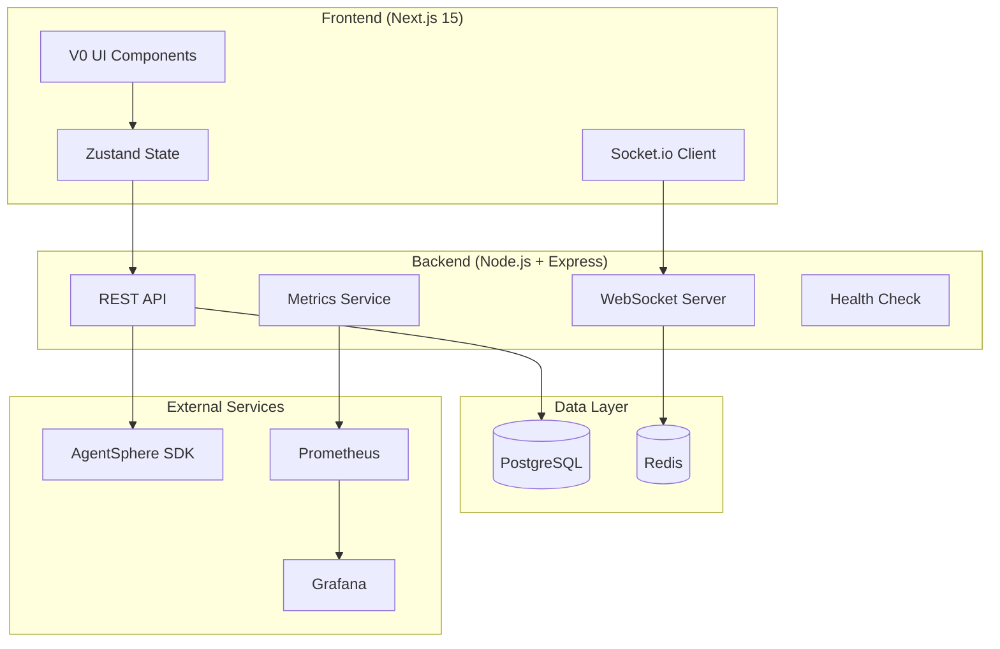
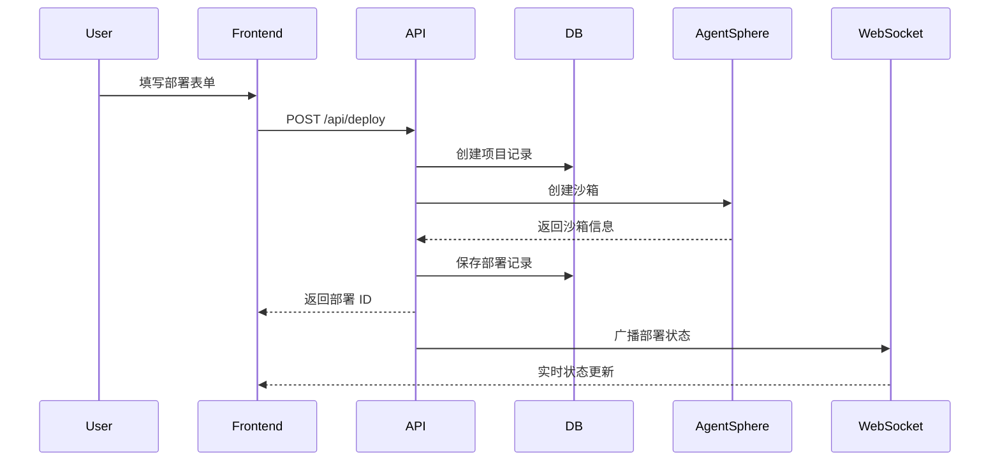
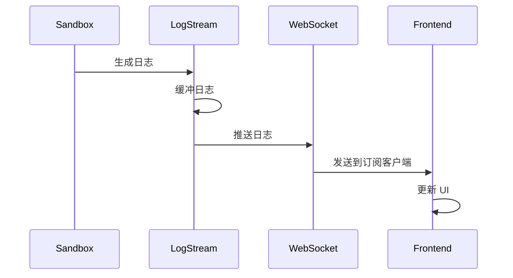

# 🏗️ CodeRunner v2.0 架构文档

> **最后更新**: 2025-08-08 Day 3
> **Phase 2 状态**: 进行中 (3/6 任务完成)

## 📋 目录

1. [系统概览](#系统概览)
2. [技术栈](#技术栈)
3. [项目结构](#项目结构)
4. [核心服务架构](#核心服务架构)
5. [实时通信架构](#实时通信架构)
6. [前端架构](#前端架构)
7. [API 端点](#api-端点)
8. [数据流](#数据流)
9. [部署架构](#部署架构)
10. [开发指南](#开发指南)

## 🌐 系统概览

CodeRunner v2.0 是一个基于 AgentSphere SDK 的业务流程编排平台，提供即时的代码部署和执行能力。



## 💻 技术栈

### 后端技术栈
| 层级 | 技术 | 版本 | 用途 |
|------|------|------|------|
| 运行时 | Node.js | 18+ | JavaScript 运行环境 |
| 语言 | TypeScript | 5.9.2 | 类型安全 |
| 框架 | Express | 4.21.2 | Web 服务器 |
| 实时通信 | Socket.io | 4.7.5 | WebSocket 通信 |
| 数据库 | PostgreSQL | 16 | 主数据存储 |
| 缓存 | Redis | 7+ | 会话/缓存 (可选) |
| SDK | AgentSphere | Latest | 沙箱管理 |
| 监控 | Prometheus | Latest | 指标收集 |

### 前端技术栈
| 层级 | 技术 | 版本 | 用途 |
|------|------|------|------|
| 框架 | Next.js | 15.2.4 | React 框架 |
| UI 库 | React | 19 | 用户界面 |
| 组件库 | shadcn/ui | Latest | UI 组件 |
| 状态管理 | Zustand | Latest | 全局状态 |
| 样式 | Tailwind CSS | 3.4.17 | 样式系统 |
| HTTP | Axios | Latest | API 调用 |
| WebSocket | Socket.io-client | Latest | 实时通信 |
| 语言 | TypeScript | 5+ | 类型安全 |

## 📁 项目结构

```
coderunner2/
├── src/                        # 后端源代码
│   ├── index.ts               # Express 服务器入口
│   ├── services/              # 核心服务
│   │   ├── database.ts        # 数据库服务 (单例)
│   │   ├── auth.ts            # 认证服务 (JWT)
│   │   ├── orchestration.ts   # 部署编排服务
│   │   ├── websocket.ts       # WebSocket 服务 ✅ P2-T01
│   │   ├── logStream.ts       # 日志流管理 ✅ P2-T01
│   │   ├── metrics.ts         # 指标收集 ✅ P2-T02
│   │   └── healthCheck.ts     # 健康检查 ✅ P2-T02
│   ├── routes/                # API 路由
│   │   ├── index.ts           # 路由聚合
│   │   ├── auth.ts            # 认证路由
│   │   ├── deploy.ts          # 部署路由
│   │   ├── deployments.ts     # 部署管理 ✅ P2-T03
│   │   └── websocket.ts       # WebSocket路由 ✅ P2-T01
│   ├── middleware/            # 中间件
│   │   └── auth.ts            # JWT 认证中间件
│   ├── types/                 # TypeScript 类型
│   │   ├── index.ts           # 通用类型
│   │   └── websocket.ts       # WebSocket 类型 ✅
│   └── utils/                 # 工具函数
│       └── logger.ts          # 日志工具 ✅
│
├── frontend/                   # 前端代码 (V0 生成)
│   ├── app/                   # Next.js 页面
│   │   ├── page.tsx           # 主仪表板 ✅ 已集成
│   │   ├── auth/page.tsx      # 认证页面 ✅ 已集成
│   │   ├── deployments/       
│   │   │   └── [id]/page.tsx  # 部署详情 ✅ 实时日志
│   │   └── deploy/new/        # 新建部署
│   ├── lib/                   # 库文件
│   │   ├── api.ts             # API 客户端 ✅
│   │   └── stores/            # Zustand 状态管理
│   │       ├── auth.store.ts  # 认证状态 ✅
│   │       └── deployments.store.ts # 部署状态 ✅
│   └── components/            # UI 组件
│       └── ui/                # shadcn/ui 组件
│
├── monitoring/                 # 监控配置 ✅ P2-T02
│   ├── prometheus.yml         # Prometheus 配置
│   ├── grafana-dashboard.json # Grafana 仪表板
│   └── README.md              # 监控文档
│
├── tests/                      # 测试文件
│   ├── services/              # 服务测试
│   ├── routes/                # 路由测试
│   └── websocket/             # WebSocket 测试
│
├── scripts/                    # 脚本文件
│   └── start-monitoring.sh    # 启动监控栈
│
└── docker-compose.monitoring.yml # 监控栈 Docker 配置
```

## 🎯 核心服务架构

### 1. DatabaseService (单例模式)
```typescript
interface DatabaseService {
  // 连接池管理
  pool: Pool
  
  // 用户管理
  createUser(email, passwordHash): User
  getUserByEmail(email): User
  
  // 项目管理
  createProject(userId, name, description): Project
  getProjectsByUserId(userId): Project[]
  
  // 部署管理
  createDeployment(projectId, sandboxInfo): Deployment
  getDeploymentsByProjectId(projectId): Deployment[]
  updateDeploymentStatus(id, status): void
}
```

### 2. AuthService (JWT 认证)
```typescript
interface AuthService {
  // 认证操作
  register(email, password): { userId, message }
  login(email, password): { token, userId }
  validateToken(token): { userId } | null
  
  // 安全配置
  JWT_SECRET: string
  TOKEN_EXPIRY: '7d'
  BCRYPT_ROUNDS: 10
}
```

### 3. OrchestrationService (部署编排)
```typescript
interface OrchestrationService {
  // 部署管理
  deploy(projectData): DeploymentResult
  getDeploymentStatus(deploymentId): Status
  
  // 沙箱管理
  createSandbox(template): SandboxInfo
  deleteSandbox(sandboxId): void
  
  // 支持的运行时
  runtimeTypes: ['nodejs', 'manifest']
}
```

## 🔌 实时通信架构 (P2-T01)

### WebSocket 服务架构
```typescript
interface WebSocketService {
  // 连接管理
  handleConnection(socket): void
  handleDisconnection(socket): void
  
  // 认证
  authenticateSocket(socket, token): boolean
  
  // 订阅管理
  subscribeToDeployment(socket, deploymentId): void
  unsubscribeFromDeployment(socket, deploymentId): void
  
  // 事件发送
  broadcastDeploymentStatus(deploymentId, status): void
  sendDeploymentLog(deploymentId, log): void
  sendMetrics(deploymentId, metrics): void
}
```

### 客户端连接流程
```javascript
// 1. 建立连接
const socket = io('ws://localhost:3000', {
  auth: { token: JWT_TOKEN }
})

// 2. 订阅部署
socket.emit('subscribe:deployment', { deploymentId })

// 3. 接收实时数据
socket.on('deployment:log', (data) => {
  // 处理日志
})

socket.on('deployment:status', (data) => {
  // 更新状态
})

socket.on('deployment:metrics', (data) => {
  // 更新指标
})
```

## 🎨 前端架构 (P2-T03)

### 状态管理架构 (Zustand)
```typescript
// 认证状态
interface AuthState {
  user: User | null
  token: string | null
  isAuthenticated: boolean
  login(email, password): Promise<void>
  logout(): void
}

// 部署状态
interface DeploymentsState {
  deployments: Deployment[]
  currentDeployment: Deployment | null
  logs: Map<string, LogEntry[]>
  
  fetchDeployments(): Promise<void>
  createDeployment(data): Promise<Deployment>
  controlDeployment(id, action): Promise<void>
  
  // WebSocket
  connectWebSocket(token): void
  subscribeToDeployment(id): void
}
```

### 页面结构
| 页面 | 路径 | 功能 | 状态 |
|------|------|------|------|
| 主仪表板 | `/` | 部署列表、统计 | ✅ 完成 |
| 认证 | `/auth` | 登录/注册 | ✅ 完成 |
| 部署详情 | `/deployments/[id]` | 日志、指标、控制 | ✅ 完成 |
| 新建部署 | `/deploy/new` | 创建新部署 | 🔧 基础完成 |
| 项目管理 | `/projects` | 项目列表 | 📝 待实现 |

## 🔗 API 端点

### 认证端点
| 方法 | 端点 | 功能 | 状态 |
|------|------|------|------|
| POST | `/api/auth/register` | 用户注册 | ✅ |
| POST | `/api/auth/login` | 用户登录 | ✅ |
| GET | `/api/auth/verify` | 验证 Token | ✅ |

### 部署端点
| 方法 | 端点 | 功能 | 状态 |
|------|------|------|------|
| POST | `/api/deploy` | 创建部署 | ✅ |
| GET | `/api/deployments` | 获取部署列表 | ✅ |
| GET | `/api/deployments/:id` | 获取部署详情 | ✅ |
| DELETE | `/api/deployments/:id` | 删除部署 | ✅ |
| POST | `/api/deployments/:id/:action` | 控制部署 | ✅ |

### WebSocket 端点
| 方法 | 端点 | 功能 | 状态 |
|------|------|------|------|
| GET | `/api/websocket/status` | WebSocket 状态 | ✅ |
| GET | `/api/websocket/deployments/:id/logs` | 获取日志 | ✅ |

### 监控端点
| 方法 | 端点 | 功能 | 状态 |
|------|------|------|------|
| GET | `/health` | 基础健康检查 | ✅ |
| GET | `/api/health` | 详细健康状态 | ✅ |
| GET | `/api/metrics` | Prometheus 指标 | ✅ |
| GET | `/api/metrics/current` | 当前指标 | ✅ |

## 🔄 数据流

### 部署创建流程


### 实时日志流程


## 🚀 部署架构

### 开发环境
```bash
# 后端启动
cd /home/ubuntu/jack/projects/coderunner2
npm run dev  # 运行在 http://localhost:3000

# 前端启动
cd frontend
npm run dev  # 运行在 http://localhost:3006

# 监控栈启动
./scripts/start-monitoring.sh
# Prometheus: http://localhost:9090
# Grafana: http://localhost:3001 (admin/admin123)
```

### 生产环境
```yaml
# Docker Compose 部署
services:
  backend:
    build: .
    ports: ["3000:3000"]
    environment:
      - NODE_ENV=production
      - DATABASE_URL=${DATABASE_URL}
      - JWT_SECRET=${JWT_SECRET}
  
  frontend:
    build: ./frontend
    ports: ["3006:3000"]
    environment:
      - NEXT_PUBLIC_API_URL=http://backend:3000/api
      - NEXT_PUBLIC_WEBSOCKET_URL=ws://backend:3000
  
  postgres:
    image: postgres:16
    volumes: ["postgres_data:/var/lib/postgresql/data"]
  
  redis:
    image: redis:alpine
    volumes: ["redis_data:/data"]
```

## 🛠️ 开发指南

### 快速开始
```bash
# 1. 克隆仓库
git clone https://github.com/yourrepo/coderunner2

# 2. 安装依赖
npm install
cd frontend && npm install --legacy-peer-deps

# 3. 设置环境变量
cp .env.example .env
# 编辑 .env 文件

# 4. 初始化数据库
npm run db:init
npm run db:migrate

# 5. 启动服务
npm run dev           # 后端
npm run dev:frontend  # 前端
```

### 添加新功能流程
1. 在 `src/services/` 创建服务类
2. 在 `src/routes/` 添加路由处理
3. 在 `src/types/` 定义 TypeScript 类型
4. 在前端 `lib/stores/` 添加状态管理
5. 在前端 `app/` 创建页面组件
6. 编写测试用例
7. 更新本文档

### 测试策略
```bash
# 单元测试
npm test

# 集成测试
npm run test:integration

# E2E 测试
npm run test:e2e

# 性能测试
npm run test:performance

# 测试覆盖率
npm run test:coverage
```

### 监控和调试
- **日志**: 查看 `backend.log`
- **健康检查**: `curl http://localhost:3000/health`
- **WebSocket 状态**: `curl http://localhost:3000/api/websocket/status`
- **指标**: 访问 Prometheus UI
- **可视化**: 访问 Grafana 仪表板

## 📊 Phase 2 进展跟踪

| 任务 | 负责人 | 状态 | 说明 |
|------|--------|------|------|
| P2-T01: WebSocket 实时日志 | backend-architect | ✅ 完成 | Socket.io 服务实现完成 |
| P2-T02: 监控指标收集 | devops-automator | ✅ 完成 | Prometheus + Grafana 集成 |
| P2-T03: V0 前端集成 | frontend-developer | ✅ 完成 | Day 3-4 任务全部完成 |
| P2-T04: 配置管理 | backend-architect | 📝 待开始 | Day 5 任务 |
| P2-T05: 自动扩缩容 | devops-automator | 📝 待开始 | Day 6 任务 |
| P2-T06: 集成测试 | test-writer-fixer | 📝 待开始 | Day 7 任务 |

## 🔐 安全考虑

1. **认证**: JWT 令牌，7天过期
2. **密码**: bcrypt 加密，10轮哈希
3. **CORS**: 配置允许的源
4. **速率限制**: WebSocket 连接限制
5. **输入验证**: 所有 API 输入验证
6. **SQL 注入**: 使用参数化查询
7. **XSS 防护**: React 自动转义
8. **HTTPS**: 生产环境强制 HTTPS

## 📝 注意事项

1. **AgentSphere SDK**: 需要有效的 API 密钥
2. **数据库迁移**: 更改 schema 后运行迁移
3. **WebSocket**: 确保防火墙允许 WebSocket 连接
4. **性能**: 监控资源使用，及时扩缩容
5. **日志**: 定期清理旧日志避免磁盘满

---

**维护者**: CodeRunner Team  
**更新频率**: 每个 Phase 完成后更新  
**下次更新**: Phase 2 完成后 (Day 7)