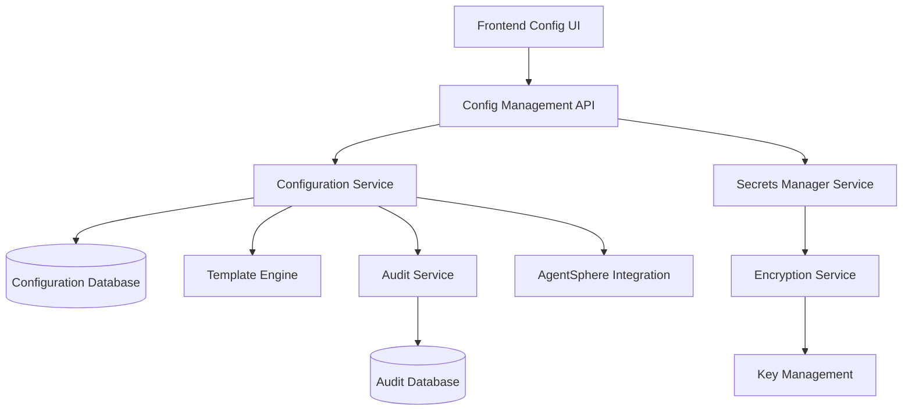
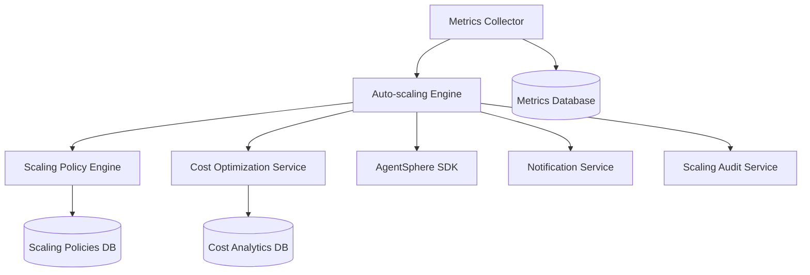
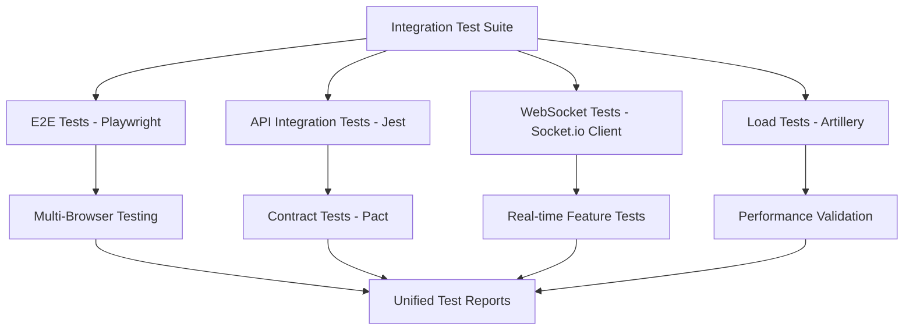

# 🏗️ Phase 2 Technical Implementation Plan

**Document Date**: 2025-08-08  
**Architect**: Backend-Architect Agent  
**Project**: CodeRunner v2.0 - Phase 2 Remaining Tasks  
**Tasks**: P2-T04, P2-T05, P2-T06  

---

## 📋 Executive Summary

This document provides detailed technical implementation plans for Phase 2 remaining tasks. Each task includes complete architecture designs, code structures, database schemas, API specifications, and integration strategies. The implementation follows enterprise-grade patterns while maintaining the project's current high-quality standards.

### Implementation Overview
- **P2-T04**: Environment & configuration management with AES-256 encryption
- **P2-T05**: Intelligent auto-scaling with cost optimization  
- **P2-T06**: Comprehensive integration testing with automation
- **Total Estimated Effort**: 28-34 development hours
- **Target Completion**: Phase 2 Day 7

---

## 🔧 P2-T04: Configuration & Environment Variable Management

### System Architecture



### Database Schema Design

```sql
-- Configuration Management Schema Extension

-- Environment configurations table
CREATE TABLE environment_configs (
    id UUID PRIMARY KEY DEFAULT gen_random_uuid(),
    project_id UUID NOT NULL REFERENCES projects(id) ON DELETE CASCADE,
    environment VARCHAR(50) NOT NULL CHECK (environment IN ('development', 'staging', 'production')),
    name VARCHAR(255) NOT NULL, -- User-friendly name
    description TEXT,
    is_active BOOLEAN NOT NULL DEFAULT true,
    created_at TIMESTAMPTZ NOT NULL DEFAULT NOW(),
    updated_at TIMESTAMPTZ NOT NULL DEFAULT NOW(),
    
    UNIQUE(project_id, environment, name)
);

-- Environment variables table (normalized approach)
CREATE TABLE environment_variables (
    id UUID PRIMARY KEY DEFAULT gen_random_uuid(),
    config_id UUID NOT NULL REFERENCES environment_configs(id) ON DELETE CASCADE,
    key VARCHAR(255) NOT NULL,
    value TEXT NOT NULL, -- Encrypted if sensitive
    is_encrypted BOOLEAN NOT NULL DEFAULT false,
    is_required BOOLEAN NOT NULL DEFAULT false,
    description TEXT,
    variable_type VARCHAR(50) DEFAULT 'string' CHECK (variable_type IN ('string', 'number', 'boolean', 'json', 'url', 'secret')),
    created_at TIMESTAMPTZ NOT NULL DEFAULT NOW(),
    updated_at TIMESTAMPTZ NOT NULL DEFAULT NOW(),
    
    UNIQUE(config_id, key)
);

-- Configuration templates
CREATE TABLE config_templates (
    id UUID PRIMARY KEY DEFAULT gen_random_uuid(),
    name VARCHAR(255) NOT NULL UNIQUE,
    description TEXT NOT NULL,
    category VARCHAR(100) NOT NULL, -- 'nodejs', 'python', 'docker', etc.
    is_official BOOLEAN NOT NULL DEFAULT false,
    usage_count INTEGER NOT NULL DEFAULT 0,
    template_data JSONB NOT NULL, -- Template structure
    created_at TIMESTAMPTZ NOT NULL DEFAULT NOW(),
    updated_at TIMESTAMPTZ NOT NULL DEFAULT NOW()
);

-- Audit logging for configuration changes
CREATE TABLE config_audit_logs (
    id UUID PRIMARY KEY DEFAULT gen_random_uuid(),
    user_id UUID NOT NULL REFERENCES users(id),
    project_id UUID NOT NULL REFERENCES projects(id),
    config_id UUID REFERENCES environment_configs(id),
    variable_id UUID REFERENCES environment_variables(id),
    action VARCHAR(50) NOT NULL CHECK (action IN ('create', 'update', 'delete', 'export', 'import')),
    resource_type VARCHAR(50) NOT NULL CHECK (resource_type IN ('config', 'variable', 'template')),
    changes JSONB, -- Before/after values (encrypted if sensitive)
    metadata JSONB, -- IP, user agent, etc.
    timestamp TIMESTAMPTZ NOT NULL DEFAULT NOW()
);

-- Indexes for performance
CREATE INDEX idx_env_configs_project_env ON environment_configs(project_id, environment);
CREATE INDEX idx_env_variables_config ON environment_variables(config_id);
CREATE INDEX idx_config_templates_category ON config_templates(category);
CREATE INDEX idx_config_audit_project_time ON config_audit_logs(project_id, timestamp DESC);
CREATE INDEX idx_config_audit_user_time ON config_audit_logs(user_id, timestamp DESC);

-- Triggers for audit logging
CREATE OR REPLACE FUNCTION log_config_changes() RETURNS TRIGGER AS $$
BEGIN
    INSERT INTO config_audit_logs (
        user_id, project_id, config_id, action, resource_type, 
        changes, timestamp
    ) VALUES (
        COALESCE(current_setting('app.current_user_id', true)::UUID, '00000000-0000-0000-0000-000000000000'::UUID),
        NEW.project_id,
        NEW.id,
        TG_OP::text,
        'config',
        jsonb_build_object('old', to_jsonb(OLD), 'new', to_jsonb(NEW)),
        NOW()
    );
    RETURN NEW;
END;
$$ LANGUAGE plpgsql;

CREATE TRIGGER config_audit_trigger 
    AFTER INSERT OR UPDATE OR DELETE ON environment_configs 
    FOR EACH ROW EXECUTE FUNCTION log_config_changes();
```

### Backend Services Implementation

#### 1. Encryption Service (`src/services/encryption.ts`)

```typescript
import crypto from 'crypto';
import { DatabaseService } from './database';

export interface EncryptionKeyMetadata {
  id: string;
  version: number;
  algorithm: string;
  keyHash: string;
  createdAt: Date;
  isActive: boolean;
}

export class EncryptionService {
  private static instance: EncryptionService;
  private algorithm = 'aes-256-gcm';
  private keyLength = 32; // 256 bits
  private ivLength = 16;  // 128 bits
  private tagLength = 16; // 128 bits
  
  private constructor(private db: DatabaseService) {}
  
  static getInstance(): EncryptionService {
    if (!EncryptionService.instance) {
      EncryptionService.instance = new EncryptionService(DatabaseService.getInstance());
    }
    return EncryptionService.instance;
  }
  
  /**
   * Get active encryption key with fallback to environment
   */
  async getEncryptionKey(): Promise<Buffer> {
    try {
      // Try to get key from database first
      const result = await this.db.query(
        'SELECT key_data FROM encryption_keys WHERE is_active = true ORDER BY created_at DESC LIMIT 1'
      );
      
      if (result.rows.length > 0) {
        return Buffer.from(result.rows[0].key_data, 'base64');
      }
    } catch (error) {
      console.warn('Failed to retrieve key from database, using fallback');
    }
    
    // Fallback to environment variable
    const envKey = process.env.ENCRYPTION_MASTER_KEY;
    if (!envKey) {
      throw new Error('No encryption key available');
    }
    
    return Buffer.from(envKey, 'base64');
  }
  
  /**
   * Encrypt sensitive value with authenticated encryption
   */
  async encrypt(plaintext: string): Promise<string> {
    try {
      const key = await this.getEncryptionKey();
      const iv = crypto.randomBytes(this.ivLength);
      
      const cipher = crypto.createCipher(this.algorithm, key);
      cipher.setAAD(Buffer.from('config-encryption', 'utf8'));
      
      let encrypted = cipher.update(plaintext, 'utf8', 'hex');
      encrypted += cipher.final('hex');
      
      const tag = cipher.getAuthTag();
      
      // Combine IV + encrypted data + auth tag
      const result = Buffer.concat([
        iv,
        Buffer.from(encrypted, 'hex'),
        tag
      ]);
      
      return result.toString('base64');
    } catch (error) {
      throw new Error(`Encryption failed: ${error.message}`);
    }
  }
  
  /**
   * Decrypt sensitive value with authentication verification
   */
  async decrypt(ciphertext: string): Promise<string> {
    try {
      const key = await this.getEncryptionKey();
      const data = Buffer.from(ciphertext, 'base64');
      
      // Extract components
      const iv = data.slice(0, this.ivLength);
      const encrypted = data.slice(this.ivLength, -this.tagLength);
      const tag = data.slice(-this.tagLength);
      
      const decipher = crypto.createDecipher(this.algorithm, key);
      decipher.setAAD(Buffer.from('config-encryption', 'utf8'));
      decipher.setAuthTag(tag);
      
      let decrypted = decipher.update(encrypted, undefined, 'utf8');
      decrypted += decipher.final('utf8');
      
      return decrypted;
    } catch (error) {
      throw new Error(`Decryption failed: ${error.message}`);
    }
  }
  
  /**
   * Generate new encryption key and store in database
   */
  async rotateEncryptionKey(): Promise<void> {
    const newKey = crypto.randomBytes(this.keyLength);
    const keyHash = crypto.createHash('sha256').update(newKey).digest('hex');
    
    await this.db.query(`
      INSERT INTO encryption_keys (key_data, key_hash, algorithm, version, is_active)
      VALUES ($1, $2, $3, 
        (SELECT COALESCE(MAX(version), 0) + 1 FROM encryption_keys), 
        true)
    `, [newKey.toString('base64'), keyHash, this.algorithm]);
    
    // Deactivate old keys
    await this.db.query('UPDATE encryption_keys SET is_active = false WHERE key_hash != $1', [keyHash]);
  }
}
```

#### 2. Configuration Service (`src/services/configManager.ts`)

```typescript
import { DatabaseService } from './database';
import { EncryptionService } from './encryption';
import { AuditService } from './audit';
import { ApiResponse, AuthenticatedRequest } from '../types';

export interface EnvironmentConfig {
  id: string;
  projectId: string;
  environment: 'development' | 'staging' | 'production';
  name: string;
  description?: string;
  variables: EnvironmentVariable[];
  isActive: boolean;
  createdAt: Date;
  updatedAt: Date;
}

export interface EnvironmentVariable {
  id: string;
  configId: string;
  key: string;
  value: string;
  isEncrypted: boolean;
  isRequired: boolean;
  description?: string;
  variableType: 'string' | 'number' | 'boolean' | 'json' | 'url' | 'secret';
  createdAt: Date;
  updatedAt: Date;
}

export interface ConfigTemplate {
  id: string;
  name: string;
  description: string;
  category: string;
  isOfficial: boolean;
  usageCount: number;
  templateData: {
    variables: TemplateVariable[];
    environments: string[];
    framework?: string;
  };
}

export interface TemplateVariable {
  key: string;
  defaultValue?: string;
  isRequired: boolean;
  isEncrypted: boolean;
  description: string;
  variableType: 'string' | 'number' | 'boolean' | 'json' | 'url' | 'secret';
  examples?: string[];
}

export class ConfigurationService {
  private static instance: ConfigurationService;
  
  private constructor(
    private db: DatabaseService,
    private encryption: EncryptionService,
    private audit: AuditService
  ) {}
  
  static getInstance(): ConfigurationService {
    if (!ConfigurationService.instance) {
      ConfigurationService.instance = new ConfigurationService(
        DatabaseService.getInstance(),
        EncryptionService.getInstance(),
        AuditService.getInstance()
      );
    }
    return ConfigurationService.instance;
  }
  
  /**
   * Create new environment configuration
   */
  async createConfiguration(
    projectId: string, 
    config: Omit<EnvironmentConfig, 'id' | 'createdAt' | 'updatedAt' | 'variables'>,
    userId: string
  ): Promise<EnvironmentConfig> {
    const result = await this.db.query(`
      INSERT INTO environment_configs (project_id, environment, name, description, is_active)
      VALUES ($1, $2, $3, $4, $5)
      RETURNING *
    `, [projectId, config.environment, config.name, config.description, config.isActive]);
    
    const newConfig = this.mapDbRowToConfig(result.rows[0]);
    
    await this.audit.logConfigChange(userId, projectId, 'create', 'config', {
      configId: newConfig.id,
      action: 'created_configuration',
      details: { environment: config.environment, name: config.name }
    });
    
    return newConfig;
  }
  
  /**
   * Add or update environment variable
   */
  async setVariable(
    configId: string,
    variable: Omit<EnvironmentVariable, 'id' | 'configId' | 'createdAt' | 'updatedAt'>,
    userId: string
  ): Promise<EnvironmentVariable> {
    let finalValue = variable.value;
    
    // Encrypt sensitive variables
    if (variable.isEncrypted || variable.variableType === 'secret') {
      finalValue = await this.encryption.encrypt(variable.value);
    }
    
    const result = await this.db.query(`
      INSERT INTO environment_variables (config_id, key, value, is_encrypted, is_required, description, variable_type)
      VALUES ($1, $2, $3, $4, $5, $6, $7)
      ON CONFLICT (config_id, key) 
      DO UPDATE SET 
        value = EXCLUDED.value,
        is_encrypted = EXCLUDED.is_encrypted,
        is_required = EXCLUDED.is_required,
        description = EXCLUDED.description,
        variable_type = EXCLUDED.variable_type,
        updated_at = NOW()
      RETURNING *
    `, [
      configId, variable.key, finalValue, 
      variable.isEncrypted || variable.variableType === 'secret',
      variable.isRequired, variable.description, variable.variableType
    ]);
    
    const config = await this.getConfigurationById(configId);
    await this.audit.logConfigChange(userId, config.projectId, 'update', 'variable', {
      configId,
      variableKey: variable.key,
      action: 'set_variable',
      details: { 
        key: variable.key, 
        type: variable.variableType,
        encrypted: variable.isEncrypted || variable.variableType === 'secret'
      }
    });
    
    return this.mapDbRowToVariable(result.rows[0]);
  }
  
  /**
   * Get configuration with decrypted variables for deployment
   */
  async getConfigurationForDeployment(
    projectId: string, 
    environment: string
  ): Promise<Record<string, string>> {
    const result = await this.db.query(`
      SELECT ev.key, ev.value, ev.is_encrypted
      FROM environment_configs ec
      JOIN environment_variables ev ON ec.id = ev.config_id
      WHERE ec.project_id = $1 AND ec.environment = $2 AND ec.is_active = true
    `, [projectId, environment]);
    
    const variables: Record<string, string> = {};
    
    for (const row of result.rows) {
      let value = row.value;
      if (row.is_encrypted) {
        value = await this.encryption.decrypt(row.value);
      }
      variables[row.key] = value;
    }
    
    return variables;
  }
  
  /**
   * Get available configuration templates
   */
  async getTemplates(category?: string): Promise<ConfigTemplate[]> {
    let query = 'SELECT * FROM config_templates WHERE 1=1';
    const params: any[] = [];
    
    if (category) {
      query += ' AND category = $1';
      params.push(category);
    }
    
    query += ' ORDER BY is_official DESC, usage_count DESC, name ASC';
    
    const result = await this.db.query(query, params);
    return result.rows.map(this.mapDbRowToTemplate);
  }
  
  /**
   * Apply template to create configuration
   */
  async applyTemplate(
    projectId: string,
    templateId: string,
    environment: string,
    overrides: Record<string, string>,
    userId: string
  ): Promise<EnvironmentConfig> {
    const template = await this.getTemplateById(templateId);
    
    // Create configuration
    const config = await this.createConfiguration(
      projectId,
      {
        environment: environment as any,
        name: `${template.name} - ${environment}`,
        description: `Configuration based on ${template.name} template`,
        isActive: true
      },
      userId
    );
    
    // Apply template variables
    for (const templateVar of template.templateData.variables) {
      const value = overrides[templateVar.key] || templateVar.defaultValue || '';
      
      if (templateVar.isRequired && !value) {
        throw new Error(`Required variable ${templateVar.key} not provided`);
      }
      
      if (value) {
        await this.setVariable(
          config.id,
          {
            key: templateVar.key,
            value,
            isEncrypted: templateVar.isEncrypted,
            isRequired: templateVar.isRequired,
            description: templateVar.description,
            variableType: templateVar.variableType
          },
          userId
        );
      }
    }
    
    // Update template usage count
    await this.db.query(
      'UPDATE config_templates SET usage_count = usage_count + 1 WHERE id = $1',
      [templateId]
    );
    
    return await this.getConfigurationById(config.id);
  }
  
  /**
   * Hot-reload configuration for running deployment
   */
  async reloadConfiguration(deploymentId: string): Promise<void> {
    // Get deployment info
    const deploymentResult = await this.db.query(
      'SELECT project_id, status FROM deployments WHERE id = $1',
      [deploymentId]
    );
    
    if (deploymentResult.rows.length === 0) {
      throw new Error('Deployment not found');
    }
    
    const { project_id, status } = deploymentResult.rows[0];
    
    if (status !== 'RUNNING') {
      throw new Error('Configuration can only be reloaded for running deployments');
    }
    
    // Get current configuration
    const config = await this.getConfigurationForDeployment(project_id, 'production');
    
    // TODO: Integrate with AgentSphere to update environment variables in running sandbox
    // This would use AgentSphere SDK to inject new environment variables
    
    console.log(`Reloading configuration for deployment ${deploymentId}`, config);
  }
  
  // Helper methods
  private mapDbRowToConfig(row: any): EnvironmentConfig {
    return {
      id: row.id,
      projectId: row.project_id,
      environment: row.environment,
      name: row.name,
      description: row.description,
      variables: [], // Loaded separately
      isActive: row.is_active,
      createdAt: row.created_at,
      updatedAt: row.updated_at
    };
  }
  
  private mapDbRowToVariable(row: any): EnvironmentVariable {
    return {
      id: row.id,
      configId: row.config_id,
      key: row.key,
      value: row.value,
      isEncrypted: row.is_encrypted,
      isRequired: row.is_required,
      description: row.description,
      variableType: row.variable_type,
      createdAt: row.created_at,
      updatedAt: row.updated_at
    };
  }
  
  private mapDbRowToTemplate(row: any): ConfigTemplate {
    return {
      id: row.id,
      name: row.name,
      description: row.description,
      category: row.category,
      isOfficial: row.is_official,
      usageCount: row.usage_count,
      templateData: row.template_data
    };
  }
  
  private async getConfigurationById(id: string): Promise<EnvironmentConfig> {
    const result = await this.db.query(
      'SELECT * FROM environment_configs WHERE id = $1',
      [id]
    );
    
    if (result.rows.length === 0) {
      throw new Error('Configuration not found');
    }
    
    const config = this.mapDbRowToConfig(result.rows[0]);
    
    // Load variables
    const variablesResult = await this.db.query(
      'SELECT * FROM environment_variables WHERE config_id = $1 ORDER BY key',
      [id]
    );
    
    config.variables = variablesResult.rows.map(this.mapDbRowToVariable);
    
    return config;
  }
  
  private async getTemplateById(id: string): Promise<ConfigTemplate> {
    const result = await this.db.query(
      'SELECT * FROM config_templates WHERE id = $1',
      [id]
    );
    
    if (result.rows.length === 0) {
      throw new Error('Template not found');
    }
    
    return this.mapDbRowToTemplate(result.rows[0]);
  }
}
```

#### 3. Configuration API Routes (`src/routes/config.ts`)

```typescript
import { Router, Request, Response } from 'express';
import { ConfigurationService } from '../services/configManager';
import { requireAuth } from '../middleware/auth';
import { ApiResponse, AuthenticatedRequest } from '../types';

const router = Router();
const configService = ConfigurationService.getInstance();

// Apply authentication to all routes
router.use(requireAuth);

/**
 * GET /api/config/projects/:projectId/environments
 * Get all environment configurations for a project
 */
router.get('/projects/:projectId/environments', async (req: AuthenticatedRequest, res: Response) => {
  try {
    const { projectId } = req.params;
    
    const configs = await configService.getProjectConfigurations(projectId);
    
    const response: ApiResponse<any> = {
      success: true,
      data: configs,
      timestamp: new Date()
    };
    
    res.json(response);
  } catch (error) {
    const response: ApiResponse = {
      success: false,
      error: error.message,
      timestamp: new Date()
    };
    
    res.status(400).json(response);
  }
});

/**
 * POST /api/config/projects/:projectId/environments
 * Create new environment configuration
 */
router.post('/projects/:projectId/environments', async (req: AuthenticatedRequest, res: Response) => {
  try {
    const { projectId } = req.params;
    const userId = req.user!.userId;
    const configData = req.body;
    
    const config = await configService.createConfiguration(projectId, configData, userId);
    
    const response: ApiResponse<any> = {
      success: true,
      data: config,
      message: 'Environment configuration created successfully',
      timestamp: new Date()
    };
    
    res.status(201).json(response);
  } catch (error) {
    const response: ApiResponse = {
      success: false,
      error: error.message,
      timestamp: new Date()
    };
    
    res.status(400).json(response);
  }
});

/**
 * PUT /api/config/environments/:configId/variables/:key
 * Set or update environment variable
 */
router.put('/environments/:configId/variables/:key', async (req: AuthenticatedRequest, res: Response) => {
  try {
    const { configId, key } = req.params;
    const userId = req.user!.userId;
    const variableData = { ...req.body, key };
    
    const variable = await configService.setVariable(configId, variableData, userId);
    
    const response: ApiResponse<any> = {
      success: true,
      data: variable,
      message: 'Environment variable updated successfully',
      timestamp: new Date()
    };
    
    res.json(response);
  } catch (error) {
    const response: ApiResponse = {
      success: false,
      error: error.message,
      timestamp: new Date()
    };
    
    res.status(400).json(response);
  }
});

/**
 * DELETE /api/config/environments/:configId/variables/:key
 * Delete environment variable
 */
router.delete('/environments/:configId/variables/:key', async (req: AuthenticatedRequest, res: Response) => {
  try {
    const { configId, key } = req.params;
    const userId = req.user!.userId;
    
    await configService.deleteVariable(configId, key, userId);
    
    const response: ApiResponse = {
      success: true,
      message: 'Environment variable deleted successfully',
      timestamp: new Date()
    };
    
    res.json(response);
  } catch (error) {
    const response: ApiResponse = {
      success: false,
      error: error.message,
      timestamp: new Date()
    };
    
    res.status(400).json(response);
  }
});

/**
 * GET /api/config/templates
 * Get available configuration templates
 */
router.get('/templates', async (req: Request, res: Response) => {
  try {
    const { category } = req.query;
    
    const templates = await configService.getTemplates(category as string);
    
    const response: ApiResponse<any> = {
      success: true,
      data: templates,
      timestamp: new Date()
    };
    
    res.json(response);
  } catch (error) {
    const response: ApiResponse = {
      success: false,
      error: error.message,
      timestamp: new Date()
    };
    
    res.status(400).json(response);
  }
});

/**
 * POST /api/config/projects/:projectId/apply-template
 * Apply configuration template to project
 */
router.post('/projects/:projectId/apply-template', async (req: AuthenticatedRequest, res: Response) => {
  try {
    const { projectId } = req.params;
    const { templateId, environment, overrides } = req.body;
    const userId = req.user!.userId;
    
    const config = await configService.applyTemplate(projectId, templateId, environment, overrides, userId);
    
    const response: ApiResponse<any> = {
      success: true,
      data: config,
      message: 'Template applied successfully',
      timestamp: new Date()
    };
    
    res.status(201).json(response);
  } catch (error) {
    const response: ApiResponse = {
      success: false,
      error: error.message,
      timestamp: new Date()
    };
    
    res.status(400).json(response);
  }
});

/**
 * POST /api/config/deployments/:deploymentId/reload
 * Hot-reload configuration for running deployment
 */
router.post('/deployments/:deploymentId/reload', async (req: AuthenticatedRequest, res: Response) => {
  try {
    const { deploymentId } = req.params;
    
    await configService.reloadConfiguration(deploymentId);
    
    const response: ApiResponse = {
      success: true,
      message: 'Configuration reloaded successfully',
      timestamp: new Date()
    };
    
    res.json(response);
  } catch (error) {
    const response: ApiResponse = {
      success: false,
      error: error.message,
      timestamp: new Date()
    };
    
    res.status(400).json(response);
  }
});

export default router;
```

### Frontend Components

#### Environment Configuration Management UI

```typescript
// frontend/components/config/EnvironmentConfigManager.tsx
import React, { useState, useEffect } from 'react';
import { Card, Button, Input, Select, Textarea, Switch } from '@/components/ui';
import { useToast } from '@/hooks/use-toast';
import { ConfigurationService } from '@/services/configuration';

export interface EnvironmentConfigManagerProps {
  projectId: string;
  onConfigurationChange?: (configs: EnvironmentConfig[]) => void;
}

export const EnvironmentConfigManager: React.FC<EnvironmentConfigManagerProps> = ({
  projectId,
  onConfigurationChange
}) => {
  const [configs, setConfigs] = useState<EnvironmentConfig[]>([]);
  const [selectedConfig, setSelectedConfig] = useState<string | null>(null);
  const [loading, setLoading] = useState(false);
  const [showNewVariable, setShowNewVariable] = useState(false);
  const { toast } = useToast();
  
  const [newVariable, setNewVariable] = useState({
    key: '',
    value: '',
    isEncrypted: false,
    isRequired: false,
    description: '',
    variableType: 'string' as const
  });
  
  // Load configurations on mount
  useEffect(() => {
    loadConfigurations();
  }, [projectId]);
  
  const loadConfigurations = async () => {
    setLoading(true);
    try {
      const response = await ConfigurationService.getProjectConfigurations(projectId);
      setConfigs(response.data);
      onConfigurationChange?.(response.data);
    } catch (error) {
      toast({
        title: 'Error Loading Configurations',
        description: error.message,
        variant: 'destructive'
      });
    } finally {
      setLoading(false);
    }
  };
  
  const handleAddVariable = async () => {
    if (!selectedConfig || !newVariable.key) return;
    
    try {
      await ConfigurationService.setVariable(selectedConfig, newVariable);
      
      toast({
        title: 'Variable Added',
        description: `${newVariable.key} has been added successfully`,
        variant: 'success'
      });
      
      setNewVariable({
        key: '',
        value: '',
        isEncrypted: false,
        isRequired: false,
        description: '',
        variableType: 'string'
      });
      
      setShowNewVariable(false);
      await loadConfigurations();
    } catch (error) {
      toast({
        title: 'Error Adding Variable',
        description: error.message,
        variant: 'destructive'
      });
    }
  };
  
  const selectedConfigData = configs.find(c => c.id === selectedConfig);
  
  return (
    <div className="space-y-6">
      {/* Environment Selection */}
      <Card className="p-6">
        <h3 className="text-lg font-semibold mb-4">Environment Configurations</h3>
        
        <div className="grid grid-cols-1 md:grid-cols-3 gap-4 mb-4">
          {configs.map((config) => (
            <div
              key={config.id}
              className={`p-4 border rounded-lg cursor-pointer transition-colors ${
                selectedConfig === config.id
                  ? 'border-primary bg-primary/5'
                  : 'border-gray-200 hover:border-gray-300'
              }`}
              onClick={() => setSelectedConfig(config.id)}
            >
              <h4 className="font-medium capitalize">{config.environment}</h4>
              <p className="text-sm text-gray-600">{config.name}</p>
              <p className="text-xs text-gray-500">
                {config.variables.length} variables
              </p>
            </div>
          ))}
        </div>
        
        <Button 
          variant="outline" 
          onClick={() => {/* TODO: Open new environment dialog */}}
        >
          Add Environment
        </Button>
      </Card>
      
      {/* Variables Management */}
      {selectedConfigData && (
        <Card className="p-6">
          <div className="flex justify-between items-center mb-4">
            <h3 className="text-lg font-semibold">
              Environment Variables - {selectedConfigData.environment}
            </h3>
            <Button 
              onClick={() => setShowNewVariable(!showNewVariable)}
              variant="default"
            >
              Add Variable
            </Button>
          </div>
          
          {/* Add New Variable Form */}
          {showNewVariable && (
            <Card className="p-4 mb-4 border-dashed">
              <div className="grid grid-cols-1 md:grid-cols-2 gap-4 mb-4">
                <Input
                  placeholder="Variable Name (e.g., API_KEY)"
                  value={newVariable.key}
                  onChange={(e) => setNewVariable(prev => ({ ...prev, key: e.target.value }))}
                />
                
                <Select
                  value={newVariable.variableType}
                  onValueChange={(value) => setNewVariable(prev => ({ 
                    ...prev, 
                    variableType: value as any 
                  }))}
                >
                  <option value="string">String</option>
                  <option value="number">Number</option>
                  <option value="boolean">Boolean</option>
                  <option value="url">URL</option>
                  <option value="secret">Secret</option>
                  <option value="json">JSON</option>
                </Select>
              </div>
              
              <div className="mb-4">
                <Textarea
                  placeholder="Variable value"
                  value={newVariable.value}
                  onChange={(e) => setNewVariable(prev => ({ ...prev, value: e.target.value }))}
                  className={newVariable.variableType === 'secret' ? 'font-mono' : ''}
                  type={newVariable.variableType === 'secret' ? 'password' : 'text'}
                />
              </div>
              
              <div className="mb-4">
                <Textarea
                  placeholder="Description (optional)"
                  value={newVariable.description}
                  onChange={(e) => setNewVariable(prev => ({ ...prev, description: e.target.value }))}
                />
              </div>
              
              <div className="flex items-center space-x-4 mb-4">
                <div className="flex items-center space-x-2">
                  <Switch
                    id="required"
                    checked={newVariable.isRequired}
                    onCheckedChange={(checked) => setNewVariable(prev => ({ 
                      ...prev, 
                      isRequired: checked 
                    }))}
                  />
                  <label htmlFor="required" className="text-sm">Required</label>
                </div>
                
                <div className="flex items-center space-x-2">
                  <Switch
                    id="encrypted"
                    checked={newVariable.isEncrypted || newVariable.variableType === 'secret'}
                    onCheckedChange={(checked) => setNewVariable(prev => ({ 
                      ...prev, 
                      isEncrypted: checked 
                    }))}
                    disabled={newVariable.variableType === 'secret'}
                  />
                  <label htmlFor="encrypted" className="text-sm">Encrypted</label>
                </div>
              </div>
              
              <div className="flex space-x-2">
                <Button onClick={handleAddVariable}>Add Variable</Button>
                <Button 
                  variant="outline" 
                  onClick={() => setShowNewVariable(false)}
                >
                  Cancel
                </Button>
              </div>
            </Card>
          )}
          
          {/* Variables List */}
          <div className="space-y-2">
            {selectedConfigData.variables.map((variable) => (
              <VariableCard
                key={variable.id}
                variable={variable}
                onUpdate={loadConfigurations}
                onDelete={loadConfigurations}
              />
            ))}
            
            {selectedConfigData.variables.length === 0 && (
              <div className="text-center py-8 text-gray-500">
                No environment variables configured.
                Add your first variable using the button above.
              </div>
            )}
          </div>
        </Card>
      )}
    </div>
  );
};
```

---

## ⚡ P2-T05: Auto-scaling & Resource Optimization

### System Architecture



### Database Schema Extensions

```sql
-- Auto-scaling policy management
CREATE TABLE scaling_policies (
    id UUID PRIMARY KEY DEFAULT gen_random_uuid(),
    deployment_id UUID NOT NULL REFERENCES deployments(id) ON DELETE CASCADE,
    name VARCHAR(255) NOT NULL,
    is_enabled BOOLEAN NOT NULL DEFAULT true,
    policy_type VARCHAR(50) NOT NULL CHECK (policy_type IN ('threshold', 'multi_metric', 'predictive', 'scheduled')),
    
    -- Scaling configuration
    min_instances INTEGER NOT NULL DEFAULT 1 CHECK (min_instances >= 1),
    max_instances INTEGER NOT NULL DEFAULT 10 CHECK (max_instances >= min_instances),
    target_instances INTEGER DEFAULT NULL,
    
    -- Scaling rules (JSONB for flexibility)
    scale_up_rules JSONB NOT NULL DEFAULT '[]',
    scale_down_rules JSONB NOT NULL DEFAULT '[]',
    
    -- Cooldown and timing
    scale_up_cooldown INTEGER NOT NULL DEFAULT 300, -- seconds
    scale_down_cooldown INTEGER NOT NULL DEFAULT 600, -- seconds
    
    -- Cost constraints
    max_hourly_cost DECIMAL(10,4) DEFAULT NULL,
    max_monthly_cost DECIMAL(10,4) DEFAULT NULL,
    
    created_at TIMESTAMPTZ NOT NULL DEFAULT NOW(),
    updated_at TIMESTAMPTZ NOT NULL DEFAULT NOW(),
    
    UNIQUE(deployment_id, name)
);

-- Scaling events history
CREATE TABLE scaling_events (
    id UUID PRIMARY KEY DEFAULT gen_random_uuid(),
    deployment_id UUID NOT NULL REFERENCES deployments(id) ON DELETE CASCADE,
    policy_id UUID REFERENCES scaling_policies(id) ON DELETE SET NULL,
    
    event_type VARCHAR(50) NOT NULL CHECK (event_type IN ('scale_up', 'scale_down', 'policy_change', 'manual_override')),
    trigger_reason VARCHAR(255) NOT NULL,
    
    -- Before/after state
    instances_before INTEGER NOT NULL,
    instances_after INTEGER NOT NULL,
    
    -- Metrics at time of scaling
    cpu_usage DECIMAL(5,2),
    memory_usage DECIMAL(5,2), 
    request_rate DECIMAL(10,2),
    response_time DECIMAL(10,2),
    
    -- Cost impact
    cost_before DECIMAL(10,4),
    cost_after DECIMAL(10,4),
    
    -- Execution details
    execution_time_ms INTEGER,
    success BOOLEAN NOT NULL DEFAULT false,
    error_message TEXT,
    
    timestamp TIMESTAMPTZ NOT NULL DEFAULT NOW()
);

-- Resource optimization recommendations
CREATE TABLE optimization_recommendations (
    id UUID PRIMARY KEY DEFAULT gen_random_uuid(),
    deployment_id UUID NOT NULL REFERENCES deployments(id) ON DELETE CASCADE,
    
    recommendation_type VARCHAR(100) NOT NULL CHECK (recommendation_type IN (
        'right_sizing', 'schedule_optimization', 'cost_reduction', 'performance_improvement'
    )),
    
    title VARCHAR(255) NOT NULL,
    description TEXT NOT NULL,
    
    -- Current vs recommended
    current_config JSONB NOT NULL,
    recommended_config JSONB NOT NULL,
    
    -- Impact estimates
    cost_impact_monthly DECIMAL(10,4),
    performance_impact_percent DECIMAL(5,2),
    confidence_score DECIMAL(3,2) CHECK (confidence_score >= 0 AND confidence_score <= 1),
    
    -- Status
    status VARCHAR(50) NOT NULL DEFAULT 'pending' CHECK (status IN ('pending', 'applied', 'dismissed', 'expired')),
    applied_at TIMESTAMPTZ,
    expires_at TIMESTAMPTZ,
    
    created_at TIMESTAMPTZ NOT NULL DEFAULT NOW()
);

-- Cost analytics and budgets
CREATE TABLE cost_analytics (
    id UUID PRIMARY KEY DEFAULT gen_random_uuid(),
    deployment_id UUID NOT NULL REFERENCES deployments(id) ON DELETE CASCADE,
    
    -- Time period
    period_start TIMESTAMPTZ NOT NULL,
    period_end TIMESTAMPTZ NOT NULL,
    period_type VARCHAR(20) NOT NULL CHECK (period_type IN ('hour', 'day', 'week', 'month')),
    
    -- Resource usage
    avg_instances DECIMAL(8,2) NOT NULL,
    max_instances INTEGER NOT NULL,
    total_instance_hours DECIMAL(12,2) NOT NULL,
    
    -- Costs breakdown
    compute_cost DECIMAL(10,4) NOT NULL DEFAULT 0,
    memory_cost DECIMAL(10,4) NOT NULL DEFAULT 0,
    storage_cost DECIMAL(10,4) NOT NULL DEFAULT 0,
    network_cost DECIMAL(10,4) NOT NULL DEFAULT 0,
    total_cost DECIMAL(10,4) NOT NULL DEFAULT 0,
    
    -- Performance metrics
    avg_cpu_usage DECIMAL(5,2),
    avg_memory_usage DECIMAL(5,2),
    avg_response_time DECIMAL(10,2),
    total_requests BIGINT DEFAULT 0,
    
    created_at TIMESTAMPTZ NOT NULL DEFAULT NOW(),
    
    UNIQUE(deployment_id, period_start, period_type)
);

-- Indexes for performance
CREATE INDEX idx_scaling_policies_deployment ON scaling_policies(deployment_id) WHERE is_enabled = true;
CREATE INDEX idx_scaling_events_deployment_time ON scaling_events(deployment_id, timestamp DESC);
CREATE INDEX idx_optimization_recs_deployment_status ON optimization_recommendations(deployment_id, status);
CREATE INDEX idx_cost_analytics_deployment_period ON cost_analytics(deployment_id, period_start DESC);

-- Auto-update triggers
CREATE TRIGGER update_scaling_policies_updated_at 
    BEFORE UPDATE ON scaling_policies 
    FOR EACH ROW EXECUTE FUNCTION update_updated_at_column();
```

### Backend Services Implementation

#### 1. Auto-scaling Engine (`src/services/autoScaler.ts`)

```typescript
import { DatabaseService } from './database';
import { MetricsService } from './metrics';
import { CostOptimizationService } from './costOptimizer';
import { NotificationService } from './notifications';

export interface ScalingRule {
  metric: 'cpu' | 'memory' | 'requests' | 'response_time';
  threshold: number;
  duration: number; // seconds - metric must exceed threshold for this long
  weight?: number;  // for multi-metric policies
}

export interface ScalingPolicy {
  id: string;
  deploymentId: string;
  name: string;
  isEnabled: boolean;
  policyType: 'threshold' | 'multi_metric' | 'predictive' | 'scheduled';
  minInstances: number;
  maxInstances: number;
  targetInstances?: number;
  scaleUpRules: ScalingRule[];
  scaleDownRules: ScalingRule[];
  scaleUpCooldown: number;
  scaleDownCooldown: number;
  maxHourlyCost?: number;
  maxMonthlyCost?: number;
  createdAt: Date;
  updatedAt: Date;
}

export interface ScalingDecision {
  deploymentId: string;
  action: 'scale_up' | 'scale_down' | 'maintain';
  currentInstances: number;
  targetInstances: number;
  reason: string;
  confidence: number;
  estimatedCostImpact: number;
  metrics: {
    cpu: number;
    memory: number;
    requests: number;
    responseTime: number;
  };
}

export class AutoScalingService {
  private static instance: AutoScalingService;
  private scalingInProgress = new Set<string>();
  private lastScalingAction = new Map<string, Date>();
  
  private constructor(
    private db: DatabaseService,
    private metrics: MetricsService,
    private costOptimizer: CostOptimizationService,
    private notifications: NotificationService
  ) {
    this.startScalingLoop();
  }
  
  static getInstance(): AutoScalingService {
    if (!AutoScalingService.instance) {
      AutoScalingService.instance = new AutoScalingService(
        DatabaseService.getInstance(),
        MetricsService.getInstance(),
        CostOptimizationService.getInstance(),
        NotificationService.getInstance()
      );
    }
    return AutoScalingService.instance;
  }
  
  /**
   * Create or update scaling policy
   */
  async upsertScalingPolicy(policy: Omit<ScalingPolicy, 'id' | 'createdAt' | 'updatedAt'>): Promise<ScalingPolicy> {
    const result = await this.db.query(`
      INSERT INTO scaling_policies (
        deployment_id, name, is_enabled, policy_type, min_instances, max_instances,
        target_instances, scale_up_rules, scale_down_rules, scale_up_cooldown,
        scale_down_cooldown, max_hourly_cost, max_monthly_cost
      ) VALUES ($1, $2, $3, $4, $5, $6, $7, $8, $9, $10, $11, $12, $13)
      ON CONFLICT (deployment_id, name)
      DO UPDATE SET
        is_enabled = EXCLUDED.is_enabled,
        policy_type = EXCLUDED.policy_type,
        min_instances = EXCLUDED.min_instances,
        max_instances = EXCLUDED.max_instances,
        target_instances = EXCLUDED.target_instances,
        scale_up_rules = EXCLUDED.scale_up_rules,
        scale_down_rules = EXCLUDED.scale_down_rules,
        scale_up_cooldown = EXCLUDED.scale_up_cooldown,
        scale_down_cooldown = EXCLUDED.scale_down_cooldown,
        max_hourly_cost = EXCLUDED.max_hourly_cost,
        max_monthly_cost = EXCLUDED.max_monthly_cost,
        updated_at = NOW()
      RETURNING *
    `, [
      policy.deploymentId, policy.name, policy.isEnabled, policy.policyType,
      policy.minInstances, policy.maxInstances, policy.targetInstances,
      JSON.stringify(policy.scaleUpRules), JSON.stringify(policy.scaleDownRules),
      policy.scaleUpCooldown, policy.scaleDownCooldown,
      policy.maxHourlyCost, policy.maxMonthlyCost
    ]);
    
    return this.mapDbRowToPolicy(result.rows[0]);
  }
  
  /**
   * Evaluate scaling decision for deployment
   */
  async evaluateScaling(deploymentId: string): Promise<ScalingDecision> {
    // Get current deployment state
    const deploymentInfo = await this.getDeploymentInfo(deploymentId);
    if (!deploymentInfo || deploymentInfo.status !== 'RUNNING') {
      return {
        deploymentId,
        action: 'maintain',
        currentInstances: deploymentInfo?.currentInstances || 0,
        targetInstances: deploymentInfo?.currentInstances || 0,
        reason: 'Deployment not running',
        confidence: 1.0,
        estimatedCostImpact: 0,
        metrics: { cpu: 0, memory: 0, requests: 0, responseTime: 0 }
      };
    }
    
    // Get active scaling policies
    const policies = await this.getActiveScalingPolicies(deploymentId);
    if (policies.length === 0) {
      return {
        deploymentId,
        action: 'maintain',
        currentInstances: deploymentInfo.currentInstances,
        targetInstances: deploymentInfo.currentInstances,
        reason: 'No active scaling policies',
        confidence: 1.0,
        estimatedCostImpact: 0,
        metrics: { cpu: 0, memory: 0, requests: 0, responseTime: 0 }
      };
    }
    
    // Check cooldown periods
    if (this.isInCooldownPeriod(deploymentId)) {
      return {
        deploymentId,
        action: 'maintain',
        currentInstances: deploymentInfo.currentInstances,
        targetInstances: deploymentInfo.currentInstances,
        reason: 'In cooldown period',
        confidence: 1.0,
        estimatedCostImpact: 0,
        metrics: { cpu: 0, memory: 0, requests: 0, responseTime: 0 }
      };
    }
    
    // Get current metrics
    const currentMetrics = await this.metrics.getCurrentDeploymentMetrics(deploymentId);
    
    // Evaluate each policy
    const decisions: ScalingDecision[] = [];
    for (const policy of policies) {
      const decision = await this.evaluatePolicyScaling(policy, deploymentInfo, currentMetrics);
      decisions.push(decision);
    }
    
    // Combine decisions (choose most conservative for safety)
    return this.combineScalingDecisions(decisions);
  }
  
  /**
   * Execute scaling action
   */
  async executeScaling(decision: ScalingDecision): Promise<boolean> {
    if (this.scalingInProgress.has(decision.deploymentId)) {
      console.log(`Scaling already in progress for deployment ${decision.deploymentId}`);
      return false;
    }
    
    if (decision.action === 'maintain') {
      return true; // No action needed
    }
    
    this.scalingInProgress.add(decision.deploymentId);
    const startTime = Date.now();
    
    try {
      // TODO: Integrate with AgentSphere to scale deployment
      // This would use AgentSphere SDK to add/remove instances
      const success = await this.executeAgentSphereScaling(
        decision.deploymentId,
        decision.currentInstances,
        decision.targetInstances
      );
      
      const executionTime = Date.now() - startTime;
      
      // Record scaling event
      await this.recordScalingEvent({
        deploymentId: decision.deploymentId,
        eventType: decision.action,
        triggerReason: decision.reason,
        instancesBefore: decision.currentInstances,
        instancesAfter: decision.targetInstances,
        metrics: decision.metrics,
        costImpact: decision.estimatedCostImpact,
        executionTime,
        success
      });
      
      // Update last scaling action timestamp
      this.lastScalingAction.set(decision.deploymentId, new Date());
      
      // Send notification
      if (success) {
        await this.notifications.sendScalingNotification(decision);
      }
      
      return success;
    } catch (error) {
      console.error(`Scaling execution failed for deployment ${decision.deploymentId}:`, error);
      
      await this.recordScalingEvent({
        deploymentId: decision.deploymentId,
        eventType: decision.action,
        triggerReason: decision.reason,
        instancesBefore: decision.currentInstances,
        instancesAfter: decision.currentInstances, // Failed, so no change
        metrics: decision.metrics,
        costImpact: 0,
        executionTime: Date.now() - startTime,
        success: false,
        errorMessage: error.message
      });
      
      return false;
    } finally {
      this.scalingInProgress.delete(decision.deploymentId);
    }
  }
  
  /**
   * Main scaling evaluation and execution loop
   */
  private async startScalingLoop(): void {
    const EVALUATION_INTERVAL = 30000; // 30 seconds
    
    setInterval(async () => {
      try {
        const activeDeployments = await this.getActiveDeployments();
        
        for (const deploymentId of activeDeployments) {
          try {
            const decision = await this.evaluateScaling(deploymentId);
            
            if (decision.action !== 'maintain') {
              console.log(`Scaling decision for ${deploymentId}:`, decision);
              await this.executeScaling(decision);
            }
          } catch (error) {
            console.error(`Scaling evaluation failed for deployment ${deploymentId}:`, error);
          }
        }
      } catch (error) {
        console.error('Scaling loop error:', error);
      }
    }, EVALUATION_INTERVAL);
  }
  
  // Helper methods
  private async evaluatePolicyScaling(
    policy: ScalingPolicy,
    deploymentInfo: any,
    metrics: any
  ): Promise<ScalingDecision> {
    const currentInstances = deploymentInfo.currentInstances;
    
    switch (policy.policyType) {
      case 'threshold':
        return this.evaluateThresholdPolicy(policy, currentInstances, metrics);
      case 'multi_metric':
        return this.evaluateMultiMetricPolicy(policy, currentInstances, metrics);
      case 'predictive':
        return this.evaluatePredictivePolicy(policy, currentInstances, metrics);
      case 'scheduled':
        return this.evaluateScheduledPolicy(policy, currentInstances, metrics);
      default:
        throw new Error(`Unknown policy type: ${policy.policyType}`);
    }
  }
  
  private async evaluateThresholdPolicy(
    policy: ScalingPolicy,
    currentInstances: number,
    metrics: any
  ): Promise<ScalingDecision> {
    // Check scale up conditions
    for (const rule of policy.scaleUpRules) {
      const metricValue = metrics[rule.metric] || 0;
      if (metricValue > rule.threshold) {
        const targetInstances = Math.min(currentInstances + 1, policy.maxInstances);
        const costImpact = await this.costOptimizer.estimateScalingCost(
          policy.deploymentId,
          currentInstances,
          targetInstances
        );
        
        // Check cost constraints
        if (this.exceedsCostLimits(policy, costImpact)) {
          return {
            deploymentId: policy.deploymentId,
            action: 'maintain',
            currentInstances,
            targetInstances: currentInstances,
            reason: 'Cost limit exceeded',
            confidence: 0.9,
            estimatedCostImpact: costImpact,
            metrics
          };
        }
        
        return {
          deploymentId: policy.deploymentId,
          action: 'scale_up',
          currentInstances,
          targetInstances,
          reason: `${rule.metric} (${metricValue}) > threshold (${rule.threshold})`,
          confidence: 0.8,
          estimatedCostImpact: costImpact,
          metrics
        };
      }
    }
    
    // Check scale down conditions
    let allBelowThreshold = true;
    for (const rule of policy.scaleDownRules) {
      const metricValue = metrics[rule.metric] || 0;
      if (metricValue >= rule.threshold) {
        allBelowThreshold = false;
        break;
      }
    }
    
    if (allBelowThreshold && currentInstances > policy.minInstances) {
      const targetInstances = Math.max(currentInstances - 1, policy.minInstances);
      const costImpact = await this.costOptimizer.estimateScalingCost(
        policy.deploymentId,
        currentInstances,
        targetInstances
      );
      
      return {
        deploymentId: policy.deploymentId,
        action: 'scale_down',
        currentInstances,
        targetInstances,
        reason: 'All metrics below scale-down thresholds',
        confidence: 0.7,
        estimatedCostImpact: costImpact,
        metrics
      };
    }
    
    return {
      deploymentId: policy.deploymentId,
      action: 'maintain',
      currentInstances,
      targetInstances: currentInstances,
      reason: 'Metrics within acceptable ranges',
      confidence: 0.9,
      estimatedCostImpact: 0,
      metrics
    };
  }
  
  private async evaluateMultiMetricPolicy(
    policy: ScalingPolicy,
    currentInstances: number,
    metrics: any
  ): Promise<ScalingDecision> {
    // Calculate weighted score for scale up
    let scaleUpScore = 0;
    let totalUpWeight = 0;
    
    for (const rule of policy.scaleUpRules) {
      const metricValue = metrics[rule.metric] || 0;
      const weight = rule.weight || 1;
      const score = Math.max(0, (metricValue - rule.threshold) / rule.threshold);
      scaleUpScore += score * weight;
      totalUpWeight += weight;
    }
    
    scaleUpScore = totalUpWeight > 0 ? scaleUpScore / totalUpWeight : 0;
    
    // Calculate weighted score for scale down
    let scaleDownScore = 0;
    let totalDownWeight = 0;
    
    for (const rule of policy.scaleDownRules) {
      const metricValue = metrics[rule.metric] || 0;
      const weight = rule.weight || 1;
      const score = Math.max(0, (rule.threshold - metricValue) / rule.threshold);
      scaleDownScore += score * weight;
      totalDownWeight += weight;
    }
    
    scaleDownScore = totalDownWeight > 0 ? scaleDownScore / totalDownWeight : 0;
    
    // Decision logic
    if (scaleUpScore > 0.5 && currentInstances < policy.maxInstances) {
      const targetInstances = Math.min(currentInstances + 1, policy.maxInstances);
      const costImpact = await this.costOptimizer.estimateScalingCost(
        policy.deploymentId,
        currentInstances,
        targetInstances
      );
      
      if (this.exceedsCostLimits(policy, costImpact)) {
        return {
          deploymentId: policy.deploymentId,
          action: 'maintain',
          currentInstances,
          targetInstances: currentInstances,
          reason: 'Cost limit exceeded',
          confidence: 0.9,
          estimatedCostImpact: costImpact,
          metrics
        };
      }
      
      return {
        deploymentId: policy.deploymentId,
        action: 'scale_up',
        currentInstances,
        targetInstances,
        reason: `Multi-metric scale up score: ${scaleUpScore.toFixed(2)}`,
        confidence: Math.min(0.9, scaleUpScore),
        estimatedCostImpact: costImpact,
        metrics
      };
    }
    
    if (scaleDownScore > 0.3 && currentInstances > policy.minInstances) {
      const targetInstances = Math.max(currentInstances - 1, policy.minInstances);
      const costImpact = await this.costOptimizer.estimateScalingCost(
        policy.deploymentId,
        currentInstances,
        targetInstances
      );
      
      return {
        deploymentId: policy.deploymentId,
        action: 'scale_down',
        currentInstances,
        targetInstances,
        reason: `Multi-metric scale down score: ${scaleDownScore.toFixed(2)}`,
        confidence: Math.min(0.8, scaleDownScore),
        estimatedCostImpact: costImpact,
        metrics
      };
    }
    
    return {
      deploymentId: policy.deploymentId,
      action: 'maintain',
      currentInstances,
      targetInstances: currentInstances,
      reason: `Multi-metric scores: up=${scaleUpScore.toFixed(2)}, down=${scaleDownScore.toFixed(2)}`,
      confidence: 0.7,
      estimatedCostImpact: 0,
      metrics
    };
  }
  
  // Additional helper methods...
  private exceedsCostLimits(policy: ScalingPolicy, costImpact: number): boolean {
    // Implementation for cost limit checking
    return false; // Placeholder
  }
  
  private isInCooldownPeriod(deploymentId: string): boolean {
    const lastAction = this.lastScalingAction.get(deploymentId);
    if (!lastAction) return false;
    
    const timeSinceLastAction = (Date.now() - lastAction.getTime()) / 1000;
    return timeSinceLastAction < 300; // 5 minutes minimum cooldown
  }
  
  // Additional methods implementation...
}
```

---

## 🧪 P2-T06: Frontend-Backend Integration Testing

### Testing Architecture



### Comprehensive Test Implementation

#### 1. End-to-End User Journey Tests (`tests/e2e/user-journeys.spec.ts`)

```typescript
import { test, expect, Page, BrowserContext } from '@playwright/test';
import { TestUserFactory } from '../utils/test-user-factory';
import { ConfigurationMockService } from '../mocks/configuration-service';

test.describe('Complete User Journeys', () => {
  let context: BrowserContext;
  let page: Page;
  let testUser: any;
  
  test.beforeAll(async ({ browser }) => {
    context = await browser.newContext();
    page = await context.newPage();
    testUser = await TestUserFactory.createTestUser();
  });
  
  test.afterAll(async () => {
    await TestUserFactory.cleanupTestUser(testUser.id);
    await context.close();
  });
  
  test('Complete Authentication Flow', async () => {
    // Register new user
    await page.goto('/register');
    await page.fill('[data-testid="email-input"]', testUser.email);
    await page.fill('[data-testid="password-input"]', testUser.password);
    await page.click('[data-testid="register-button"]');
    
    // Verify redirect to dashboard
    await expect(page).toHaveURL('/dashboard');
    await expect(page.locator('[data-testid="user-menu"]')).toBeVisible();
    
    // Logout
    await page.click('[data-testid="user-menu"]');
    await page.click('[data-testid="logout-button"]');
    await expect(page).toHaveURL('/login');
    
    // Login with same credentials
    await page.fill('[data-testid="email-input"]', testUser.email);
    await page.fill('[data-testid="password-input"]', testUser.password);
    await page.click('[data-testid="login-button"]');
    
    // Verify successful login
    await expect(page).toHaveURL('/dashboard');
    await expect(page.locator('[data-testid="user-menu"]')).toBeVisible();
  });
  
  test('Complete Project & Deployment Lifecycle', async () => {
    // Login first
    await page.goto('/login');
    await page.fill('[data-testid="email-input"]', testUser.email);
    await page.fill('[data-testid="password-input"]', testUser.password);
    await page.click('[data-testid="login-button"]');
    
    // Create new project
    await page.click('[data-testid="create-project-button"]');
    await page.fill('[data-testid="project-name-input"]', 'E2E Test Project');
    await page.fill('[data-testid="project-description-input"]', 'Test project for E2E testing');
    await page.click('[data-testid="create-project-submit"]');
    
    // Verify project creation
    await expect(page.locator('[data-testid="project-card"]')).toBeVisible();
    await expect(page.locator('text=E2E Test Project')).toBeVisible();
    
    // Navigate to project details
    await page.click('[data-testid="project-card"]');
    await expect(page).toHaveURL(/\/projects\/[a-f0-9-]+/);
    
    // Configure environment variables
    await page.click('[data-testid="environment-config-tab"]');
    await page.click('[data-testid="add-variable-button"]');
    
    await page.fill('[data-testid="variable-key-input"]', 'NODE_ENV');
    await page.fill('[data-testid="variable-value-input"]', 'production');
    await page.selectOption('[data-testid="variable-type-select"]', 'string');
    await page.click('[data-testid="save-variable-button"]');
    
    // Verify variable was added
    await expect(page.locator('text=NODE_ENV')).toBeVisible();
    await expect(page.locator('text=production')).toBeVisible();
    
    // Deploy project
    await page.click('[data-testid="deploy-tab"]');
    await page.click('[data-testid="deploy-button"]');
    
    // Wait for deployment to start
    await expect(page.locator('[data-testid="deployment-status"]')).toHaveText('PENDING');
    
    // Wait for deployment to complete (with timeout)
    await expect(page.locator('[data-testid="deployment-status"]')).toHaveText('RUNNING', { timeout: 120000 });
    
    // Verify deployment details
    await expect(page.locator('[data-testid="deployment-url"]')).toBeVisible();
    await expect(page.locator('[data-testid="deployment-logs"]')).toBeVisible();
    
    // Test real-time log streaming
    const logContainer = page.locator('[data-testid="deployment-logs"]');
    const initialLogCount = await logContainer.locator('.log-line').count();
    
    // Wait for new logs to appear
    await page.waitForTimeout(5000);
    const finalLogCount = await logContainer.locator('.log-line').count();
    expect(finalLogCount).toBeGreaterThan(initialLogCount);
    
    // Test deployment controls
    await page.click('[data-testid="stop-deployment-button"]');
    await expect(page.locator('[data-testid="deployment-status"]')).toHaveText('STOPPED');
    
    await page.click('[data-testid="start-deployment-button"]');
    await expect(page.locator('[data-testid="deployment-status"]')).toHaveText('RUNNING');
    
    // Delete deployment
    await page.click('[data-testid="delete-deployment-button"]');
    await page.click('[data-testid="confirm-delete-button"]');
    await expect(page.locator('[data-testid="deployment-status"]')).toHaveText('DESTROYED');
  });
  
  test('Real-time Features Validation', async () => {
    // Login and create deployment
    await page.goto('/login');
    await page.fill('[data-testid="email-input"]', testUser.email);
    await page.fill('[data-testid="password-input"]', testUser.password);
    await page.click('[data-testid="login-button"]');
    
    // Navigate to existing project or create one
    const deploymentId = await this.setupTestDeployment(page);
    
    await page.goto(`/deployments/${deploymentId}`);
    
    // Test WebSocket connection
    const wsConnectionStatus = page.locator('[data-testid="ws-status"]');
    await expect(wsConnectionStatus).toHaveClass(/connected/);
    
    // Test real-time metrics updates
    const cpuMetric = page.locator('[data-testid="cpu-metric"]');
    const memoryMetric = page.locator('[data-testid="memory-metric"]');
    
    const initialCpuText = await cpuMetric.textContent();
    const initialMemoryText = await memoryMetric.textContent();
    
    // Wait for metrics to update
    await page.waitForTimeout(10000);
    
    const updatedCpuText = await cpuMetric.textContent();
    const updatedMemoryText = await memoryMetric.textContent();
    
    // Verify metrics are updating
    expect(updatedCpuText !== initialCpuText || updatedMemoryText !== initialMemoryText).toBeTruthy();
    
    // Test log filtering
    await page.fill('[data-testid="log-filter-input"]', 'error');
    const filteredLogs = page.locator('[data-testid="deployment-logs"] .log-line');
    
    // Verify all visible logs contain 'error'
    const logCount = await filteredLogs.count();
    for (let i = 0; i < logCount; i++) {
      const logText = await filteredLogs.nth(i).textContent();
      expect(logText?.toLowerCase()).toContain('error');
    }
    
    // Test log export
    const downloadPromise = page.waitForEvent('download');
    await page.click('[data-testid="export-logs-button"]');
    const download = await downloadPromise;
    expect(download.suggestedFilename()).toMatch(/deployment-.*-logs\.txt/);
  });
  
  test('Multi-user Isolation Validation', async () => {
    // Create second test user
    const secondUser = await TestUserFactory.createTestUser();
    
    try {
      // Login as first user and create project
      await page.goto('/login');
      await page.fill('[data-testid="email-input"]', testUser.email);
      await page.fill('[data-testid="password-input"]', testUser.password);
      await page.click('[data-testid="login-button"]');
      
      await page.click('[data-testid="create-project-button"]');
      await page.fill('[data-testid="project-name-input"]', 'User1 Private Project');
      await page.click('[data-testid="create-project-submit"]');
      
      const user1ProjectUrl = page.url();
      
      // Open incognito window for second user
      const incognitoContext = await page.context().browser()!.newContext();
      const incognitoPage = await incognitoContext.newPage();
      
      // Login as second user
      await incognitoPage.goto('/login');
      await incognitoPage.fill('[data-testid="email-input"]', secondUser.email);
      await incognitoPage.fill('[data-testid="password-input"]', secondUser.password);
      await incognitoPage.click('[data-testid="login-button"]');
      
      // Verify second user cannot access first user's project
      await incognitoPage.goto(user1ProjectUrl);
      await expect(incognitoPage.locator('text=Access Denied')).toBeVisible();
      
      // Verify second user sees empty project list
      await incognitoPage.goto('/dashboard');
      await expect(incognitoPage.locator('[data-testid="project-card"]')).not.toBeVisible();
      await expect(incognitoPage.locator('text=No projects found')).toBeVisible();
      
      await incognitoContext.close();
    } finally {
      await TestUserFactory.cleanupTestUser(secondUser.id);
    }
  });
  
  private async setupTestDeployment(page: Page): Promise<string> {
    // Implementation to create a test deployment
    // Returns deployment ID for testing
    return 'test-deployment-id';
  }
});
```

#### 2. Cross-browser Compatibility Tests (`tests/e2e/cross-browser.spec.ts`)

```typescript
import { test, expect, devices } from '@playwright/test';

const browsers = [
  { name: 'Chrome', ...devices['Desktop Chrome'] },
  { name: 'Firefox', ...devices['Desktop Firefox'] },
  { name: 'Safari', ...devices['Desktop Safari'] },
  { name: 'Edge', ...devices['Desktop Edge'] }
];

browsers.forEach(({ name, ...device }) => {
  test.describe(`Cross-browser tests - ${name}`, () => {
    test.use(device);
    
    test(`Core functionality works in ${name}`, async ({ page }) => {
      // Test basic page loads
      await page.goto('/');
      await expect(page.locator('h1')).toBeVisible();
      
      await page.goto('/login');
      await expect(page.locator('[data-testid="login-form"]')).toBeVisible();
      
      await page.goto('/register');
      await expect(page.locator('[data-testid="register-form"]')).toBeVisible();
    });
    
    test(`WebSocket connection works in ${name}`, async ({ page }) => {
      const testUser = await TestUserFactory.createTestUser();
      
      try {
        await page.goto('/login');
        await page.fill('[data-testid="email-input"]', testUser.email);
        await page.fill('[data-testid="password-input"]', testUser.password);
        await page.click('[data-testid="login-button"]');
        
        await page.goto('/dashboard');
        
        // Check WebSocket connection status
        await expect(page.locator('[data-testid="ws-status"]')).toHaveClass(/connected/, { timeout: 10000 });
        
        // Verify real-time updates work
        const statusElement = page.locator('[data-testid="connection-status"]');
        await expect(statusElement).toContainText('Connected');
      } finally {
        await TestUserFactory.cleanupTestUser(testUser.id);
      }
    });
    
    test(`Responsive design works in ${name}`, async ({ page }) => {
      // Test mobile viewport
      await page.setViewportSize({ width: 375, height: 667 });
      await page.goto('/');
      
      // Check mobile menu
      await expect(page.locator('[data-testid="mobile-menu-button"]')).toBeVisible();
      await page.click('[data-testid="mobile-menu-button"]');
      await expect(page.locator('[data-testid="mobile-menu"]')).toBeVisible();
      
      // Test tablet viewport
      await page.setViewportSize({ width: 768, height: 1024 });
      await page.goto('/dashboard');
      
      // Check responsive grid
      await expect(page.locator('[data-testid="project-grid"]')).toHaveClass(/responsive-grid/);
      
      // Test desktop viewport
      await page.setViewportSize({ width: 1920, height: 1080 });
      await page.goto('/dashboard');
      
      // Check desktop layout
      await expect(page.locator('[data-testid="sidebar"]')).toBeVisible();
      await expect(page.locator('[data-testid="main-content"]')).toBeVisible();
    });
  });
});
```

#### 3. API Integration Tests (`tests/integration/api-integration.spec.ts`)

```typescript
import request from 'supertest';
import { app } from '../../src/index';
import { TestUserFactory } from '../utils/test-user-factory';
import { DatabaseService } from '../../src/services/database';

describe('API Integration Tests', () => {
  let authToken: string;
  let testUser: any;
  let projectId: string;
  let deploymentId: string;
  
  beforeAll(async () => {
    // Setup test user
    testUser = await TestUserFactory.createTestUser();
    
    // Login to get auth token
    const loginResponse = await request(app)
      .post('/api/auth/login')
      .send({
        email: testUser.email,
        password: testUser.password
      });
    
    authToken = loginResponse.body.data.token;
  });
  
  afterAll(async () => {
    await TestUserFactory.cleanupTestUser(testUser.id);
  });
  
  describe('Authentication API', () => {
    test('POST /api/auth/login - Valid credentials', async () => {
      const response = await request(app)
        .post('/api/auth/login')
        .send({
          email: testUser.email,
          password: testUser.password
        });
      
      expect(response.status).toBe(200);
      expect(response.body.success).toBe(true);
      expect(response.body.data).toHaveProperty('token');
      expect(response.body.data).toHaveProperty('user');
      expect(response.body.data.user.email).toBe(testUser.email);
    });
    
    test('POST /api/auth/login - Invalid credentials', async () => {
      const response = await request(app)
        .post('/api/auth/login')
        .send({
          email: testUser.email,
          password: 'wrongpassword'
        });
      
      expect(response.status).toBe(401);
      expect(response.body.success).toBe(false);
      expect(response.body.error).toContain('Invalid credentials');
    });
    
    test('GET /api/auth/me - Authenticated request', async () => {
      const response = await request(app)
        .get('/api/auth/me')
        .set('Authorization', `Bearer ${authToken}`);
      
      expect(response.status).toBe(200);
      expect(response.body.success).toBe(true);
      expect(response.body.data.email).toBe(testUser.email);
    });
    
    test('GET /api/auth/me - Unauthenticated request', async () => {
      const response = await request(app)
        .get('/api/auth/me');
      
      expect(response.status).toBe(401);
      expect(response.body.success).toBe(false);
    });
  });
  
  describe('Project Management API', () => {
    test('POST /api/projects - Create project', async () => {
      const response = await request(app)
        .post('/api/projects')
        .set('Authorization', `Bearer ${authToken}`)
        .send({
          name: 'Integration Test Project',
          description: 'Test project for API integration testing'
        });
      
      expect(response.status).toBe(201);
      expect(response.body.success).toBe(true);
      expect(response.body.data).toHaveProperty('id');
      expect(response.body.data.name).toBe('Integration Test Project');
      
      projectId = response.body.data.id;
    });
    
    test('GET /api/projects - List projects', async () => {
      const response = await request(app)
        .get('/api/projects')
        .set('Authorization', `Bearer ${authToken}`);
      
      expect(response.status).toBe(200);
      expect(response.body.success).toBe(true);
      expect(Array.isArray(response.body.data)).toBe(true);
      expect(response.body.data.length).toBeGreaterThan(0);
      expect(response.body.data[0]).toHaveProperty('id');
      expect(response.body.data[0]).toHaveProperty('name');
    });
    
    test('GET /api/projects/:id - Get specific project', async () => {
      const response = await request(app)
        .get(`/api/projects/${projectId}`)
        .set('Authorization', `Bearer ${authToken}`);
      
      expect(response.status).toBe(200);
      expect(response.body.success).toBe(true);
      expect(response.body.data.id).toBe(projectId);
      expect(response.body.data.name).toBe('Integration Test Project');
    });
    
    test('PUT /api/projects/:id - Update project', async () => {
      const response = await request(app)
        .put(`/api/projects/${projectId}`)
        .set('Authorization', `Bearer ${authToken}`)
        .send({
          name: 'Updated Integration Test Project',
          description: 'Updated description'
        });
      
      expect(response.status).toBe(200);
      expect(response.body.success).toBe(true);
      expect(response.body.data.name).toBe('Updated Integration Test Project');
    });
  });
  
  describe('Configuration Management API', () => {
    test('POST /api/config/projects/:projectId/environments - Create environment config', async () => {
      const response = await request(app)
        .post(`/api/config/projects/${projectId}/environments`)
        .set('Authorization', `Bearer ${authToken}`)
        .send({
          environment: 'development',
          name: 'Development Config',
          description: 'Development environment configuration'
        });
      
      expect(response.status).toBe(201);
      expect(response.body.success).toBe(true);
      expect(response.body.data.environment).toBe('development');
      expect(response.body.data.name).toBe('Development Config');
    });
    
    test('PUT /api/config/environments/:configId/variables/:key - Set environment variable', async () => {
      // First get the config ID
      const configsResponse = await request(app)
        .get(`/api/config/projects/${projectId}/environments`)
        .set('Authorization', `Bearer ${authToken}`);
      
      const configId = configsResponse.body.data[0].id;
      
      const response = await request(app)
        .put(`/api/config/environments/${configId}/variables/API_KEY`)
        .set('Authorization', `Bearer ${authToken}`)
        .send({
          value: 'test-api-key-value',
          isEncrypted: true,
          isRequired: true,
          description: 'API key for external service',
          variableType: 'secret'
        });
      
      expect(response.status).toBe(200);
      expect(response.body.success).toBe(true);
      expect(response.body.data.key).toBe('API_KEY');
      expect(response.body.data.isEncrypted).toBe(true);
      expect(response.body.data.variableType).toBe('secret');
    });
  });
  
  describe('Deployment API', () => {
    test('POST /api/deployments - Create deployment', async () => {
      const response = await request(app)
        .post('/api/deployments')
        .set('Authorization', `Bearer ${authToken}`)
        .send({
          projectId,
          environment: 'development',
          runtimeType: 'nodejs'
        });
      
      expect(response.status).toBe(201);
      expect(response.body.success).toBe(true);
      expect(response.body.data).toHaveProperty('id');
      expect(response.body.data.status).toBe('PENDING');
      
      deploymentId = response.body.data.id;
    });
    
    test('GET /api/deployments/:id/status - Get deployment status', async () => {
      const response = await request(app)
        .get(`/api/deployments/${deploymentId}/status`)
        .set('Authorization', `Bearer ${authToken}`);
      
      expect(response.status).toBe(200);
      expect(response.body.success).toBe(true);
      expect(response.body.data).toHaveProperty('status');
      expect(['PENDING', 'PROVISIONING', 'BUILDING', 'RUNNING'].includes(response.body.data.status)).toBe(true);
    });
  });
  
  describe('Error Handling', () => {
    test('404 for non-existent resources', async () => {
      const response = await request(app)
        .get('/api/projects/non-existent-id')
        .set('Authorization', `Bearer ${authToken}`);
      
      expect(response.status).toBe(404);
      expect(response.body.success).toBe(false);
      expect(response.body.error).toContain('not found');
    });
    
    test('Validation errors return 400', async () => {
      const response = await request(app)
        .post('/api/projects')
        .set('Authorization', `Bearer ${authToken}`)
        .send({
          // Missing required 'name' field
          description: 'Project without name'
        });
      
      expect(response.status).toBe(400);
      expect(response.body.success).toBe(false);
      expect(response.body.error).toContain('validation');
    });
  });
  
  describe('Performance Tests', () => {
    test('API response times under load', async () => {
      const startTime = Date.now();
      
      // Make 10 concurrent requests
      const promises = Array.from({ length: 10 }, () =>
        request(app)
          .get('/api/projects')
          .set('Authorization', `Bearer ${authToken}`)
      );
      
      const responses = await Promise.all(promises);
      const endTime = Date.now();
      
      const totalTime = endTime - startTime;
      const averageTime = totalTime / 10;
      
      // All requests should succeed
      responses.forEach(response => {
        expect(response.status).toBe(200);
        expect(response.body.success).toBe(true);
      });
      
      // Average response time should be reasonable
      expect(averageTime).toBeLessThan(500); // 500ms average
    });
  });
});
```

#### 4. WebSocket Real-time Tests (`tests/websocket/real-time-features.spec.ts`)

```typescript
import { io, Socket } from 'socket.io-client';
import { TestUserFactory } from '../utils/test-user-factory';
import { DatabaseService } from '../../src/services/database';

describe('WebSocket Real-time Features', () => {
  let clientSocket: Socket;
  let authToken: string;
  let testUser: any;
  
  beforeAll(async () => {
    testUser = await TestUserFactory.createTestUser();
    authToken = await TestUserFactory.getAuthToken(testUser);
  });
  
  afterAll(async () => {
    await TestUserFactory.cleanupTestUser(testUser.id);
  });
  
  beforeEach((done) => {
    clientSocket = io('http://localhost:3000', {
      auth: { token: authToken },
      forceNew: true
    });
    
    clientSocket.on('connect', done);
  });
  
  afterEach(() => {
    if (clientSocket.connected) {
      clientSocket.disconnect();
    }
  });
  
  describe('Connection Management', () => {
    test('Should connect with valid auth token', (done) => {
      expect(clientSocket.connected).toBe(true);
      done();
    });
    
    test('Should reject connection with invalid token', (done) => {
      const invalidSocket = io('http://localhost:3000', {
        auth: { token: 'invalid-token' },
        forceNew: true
      });
      
      invalidSocket.on('connect_error', (error) => {
        expect(error.message).toContain('Authentication failed');
        invalidSocket.disconnect();
        done();
      });
      
      invalidSocket.on('connect', () => {
        fail('Should not connect with invalid token');
        invalidSocket.disconnect();
        done();
      });
    });
    
    test('Should handle reconnection gracefully', (done) => {
      let reconnectCount = 0;
      
      clientSocket.on('reconnect', () => {
        reconnectCount++;
        if (reconnectCount === 1) {
          expect(clientSocket.connected).toBe(true);
          done();
        }
      });
      
      // Simulate connection loss
      clientSocket.disconnect();
      
      // Reconnect
      setTimeout(() => {
        clientSocket.connect();
      }, 100);
    });
  });
  
  describe('Deployment Log Streaming', () => {
    test('Should receive real-time log updates', (done) => {
      const deploymentId = 'test-deployment-id';
      const receivedLogs: any[] = [];
      
      clientSocket.emit('subscribe_logs', { deploymentId });
      
      clientSocket.on('log_update', (data) => {
        receivedLogs.push(data);
        
        expect(data).toHaveProperty('deploymentId');
        expect(data).toHaveProperty('timestamp');
        expect(data).toHaveProperty('level');
        expect(data).toHaveProperty('message');
        expect(data.deploymentId).toBe(deploymentId);
        
        if (receivedLogs.length >= 3) {
          // Verify we received multiple log entries
          expect(receivedLogs.length).toBeGreaterThanOrEqual(3);
          
          // Verify log ordering by timestamp
          for (let i = 1; i < receivedLogs.length; i++) {
            const prevTime = new Date(receivedLogs[i - 1].timestamp);
            const currTime = new Date(receivedLogs[i].timestamp);
            expect(currTime.getTime()).toBeGreaterThanOrEqual(prevTime.getTime());
          }
          
          done();
        }
      });
      
      // Simulate log generation
      setTimeout(() => {
        // This would trigger log generation in the actual deployment
        // For testing, we can emit mock logs from the server
        this.triggerMockLogs(deploymentId);
      }, 100);
    });
    
    test('Should handle log filtering', (done) => {
      const deploymentId = 'test-deployment-id';
      const filter = 'error';
      const receivedLogs: any[] = [];
      
      clientSocket.emit('subscribe_logs', { deploymentId, filter });
      
      clientSocket.on('log_update', (data) => {
        receivedLogs.push(data);
        
        // Verify all logs contain the filter term
        expect(data.message.toLowerCase()).toContain(filter);
        
        if (receivedLogs.length >= 2) {
          done();
        }
      });
      
      // Trigger mixed log levels
      setTimeout(() => {
        this.triggerMockLogs(deploymentId, ['info', 'error', 'warn', 'error']);
      }, 100);
    });
    
    test('Should unsubscribe from logs', (done) => {
      const deploymentId = 'test-deployment-id';
      let logCount = 0;
      
      clientSocket.emit('subscribe_logs', { deploymentId });
      
      clientSocket.on('log_update', () => {
        logCount++;
        
        if (logCount === 2) {
          // Unsubscribe after receiving some logs
          clientSocket.emit('unsubscribe_logs', { deploymentId });
          
          // Wait a bit and verify no more logs are received
          setTimeout(() => {
            const finalCount = logCount;
            
            setTimeout(() => {
              expect(logCount).toBe(finalCount);
              done();
            }, 1000);
          }, 500);
        }
      });
      
      this.triggerMockLogs(deploymentId);
    });
  });
  
  describe('Deployment Status Updates', () => {
    test('Should receive status change notifications', (done) => {
      const deploymentId = 'test-deployment-id';
      const expectedStatuses = ['PENDING', 'PROVISIONING', 'BUILDING', 'RUNNING'];
      const receivedStatuses: string[] = [];
      
      clientSocket.emit('subscribe_status', { deploymentId });
      
      clientSocket.on('status_update', (data) => {
        expect(data).toHaveProperty('deploymentId');
        expect(data).toHaveProperty('status');
        expect(data).toHaveProperty('timestamp');
        expect(data.deploymentId).toBe(deploymentId);
        
        receivedStatuses.push(data.status);
        
        if (receivedStatuses.length === expectedStatuses.length) {
          expect(receivedStatuses).toEqual(expectedStatuses);
          done();
        }
      });
      
      // Simulate status progression
      this.simulateStatusProgression(deploymentId, expectedStatuses);
    });
  });
  
  describe('Metrics Streaming', () => {
    test('Should receive real-time performance metrics', (done) => {
      const deploymentId = 'test-deployment-id';
      const receivedMetrics: any[] = [];
      
      clientSocket.emit('subscribe_metrics', { deploymentId });
      
      clientSocket.on('metrics_update', (data) => {
        receivedMetrics.push(data);
        
        expect(data).toHaveProperty('deploymentId');
        expect(data).toHaveProperty('timestamp');
        expect(data).toHaveProperty('metrics');
        expect(data.metrics).toHaveProperty('cpu');
        expect(data.metrics).toHaveProperty('memory');
        expect(data.metrics).toHaveProperty('requests');
        
        // Verify metric values are reasonable
        expect(data.metrics.cpu).toBeGreaterThanOrEqual(0);
        expect(data.metrics.cpu).toBeLessThanOrEqual(100);
        expect(data.metrics.memory).toBeGreaterThanOrEqual(0);
        expect(data.metrics.memory).toBeLessThanOrEqual(100);
        
        if (receivedMetrics.length >= 5) {
          // Verify we received multiple metric updates
          expect(receivedMetrics.length).toBeGreaterThanOrEqual(5);
          
          // Verify metrics are updating (not all identical)
          const cpuValues = receivedMetrics.map(m => m.metrics.cpu);
          const uniqueCpuValues = new Set(cpuValues);
          expect(uniqueCpuValues.size).toBeGreaterThan(1);
          
          done();
        }
      });
      
      // Start metrics simulation
      this.simulateMetricsStream(deploymentId);
    });
  });
  
  describe('Error Handling', () => {
    test('Should handle WebSocket errors gracefully', (done) => {
      clientSocket.on('error', (error) => {
        expect(error).toHaveProperty('message');
        expect(error.message).toBeDefined();
        done();
      });
      
      // Trigger an error condition
      clientSocket.emit('invalid_event', { malformedData: true });
    });
    
    test('Should handle subscription to non-existent deployment', (done) => {
      clientSocket.emit('subscribe_logs', { deploymentId: 'non-existent-deployment' });
      
      clientSocket.on('subscription_error', (error) => {
        expect(error.message).toContain('Deployment not found');
        done();
      });
    });
  });
  
  describe('Performance Under Load', () => {
    test('Should handle multiple concurrent subscriptions', (done) => {
      const deploymentIds = ['deploy-1', 'deploy-2', 'deploy-3'];
      const subscriptionResults: { [key: string]: boolean } = {};
      
      deploymentIds.forEach(deploymentId => {
        clientSocket.emit('subscribe_logs', { deploymentId });
        clientSocket.emit('subscribe_status', { deploymentId });
        clientSocket.emit('subscribe_metrics', { deploymentId });
      });
      
      clientSocket.on('subscription_confirmed', (data) => {
        subscriptionResults[data.deploymentId] = true;
        
        if (Object.keys(subscriptionResults).length === deploymentIds.length) {
          expect(Object.keys(subscriptionResults).length).toBe(3);
          done();
        }
      });
      
      // Timeout safety
      setTimeout(() => {
        if (Object.keys(subscriptionResults).length < deploymentIds.length) {
          fail('Not all subscriptions were confirmed in time');
        }
        done();
      }, 5000);
    });
  });
  
  // Helper methods for test simulation
  private triggerMockLogs(deploymentId: string, levels: string[] = ['info', 'warn', 'error']): void {
    // This would be implemented to trigger actual log generation
    // For testing, we can mock this
  }
  
  private simulateStatusProgression(deploymentId: string, statuses: string[]): void {
    // This would simulate actual deployment status changes
    statuses.forEach((status, index) => {
      setTimeout(() => {
        // Trigger status update on server
        this.updateDeploymentStatus(deploymentId, status);
      }, index * 500);
    });
  }
  
  private simulateMetricsStream(deploymentId: string): void {
    // This would simulate real metrics generation
    let metricsCount = 0;
    const metricsInterval = setInterval(() => {
      if (metricsCount >= 10) {
        clearInterval(metricsInterval);
        return;
      }
      
      // Generate mock metrics
      this.generateMockMetrics(deploymentId);
      metricsCount++;
    }, 200);
  }
  
  private updateDeploymentStatus(deploymentId: string, status: string): void {
    // Implementation would trigger actual status update
  }
  
  private generateMockMetrics(deploymentId: string): void {
    // Implementation would generate actual metrics
  }
});
```

#### 5. Load Testing Configuration (`tests/performance/load-test.yml`)

```yaml
# Artillery Load Testing Configuration
config:
  target: 'http://localhost:3000'
  phases:
    - duration: 60
      arrivalRate: 5
      name: "Warm up"
    - duration: 120
      arrivalRate: 10
      name: "Moderate load"
    - duration: 60
      arrivalRate: 20
      name: "High load"
    - duration: 30
      arrivalRate: 2
      name: "Cool down"
  
  # Performance thresholds
  ensure:
    - http.response_time.p95: 500  # 95% of responses under 500ms
    - http.response_time.p99: 1000 # 99% of responses under 1s
    - http.codes.200: 95           # 95% success rate minimum
    - websocket.messages_sent: 1000 # WebSocket message throughput

  plugins:
    - artillery-plugin-metrics-by-endpoint
    - artillery-plugin-ensure

  processor: "./test-data-processor.js"

scenarios:
  - name: "Authentication Flow"
    weight: 30
    flow:
      - post:
          url: "/api/auth/login"
          json:
            email: "{{ email }}"
            password: "{{ password }}"
          capture:
            - json: "$.data.token"
              as: "authToken"
      - get:
          url: "/api/auth/me"
          headers:
            Authorization: "Bearer {{ authToken }}"
          expect:
            - statusCode: 200

  - name: "Project Operations"
    weight: 40
    flow:
      - post:
          url: "/api/auth/login"
          json:
            email: "{{ email }}"
            password: "{{ password }}"
          capture:
            - json: "$.data.token"
              as: "authToken"
      
      - get:
          url: "/api/projects"
          headers:
            Authorization: "Bearer {{ authToken }}"
          expect:
            - statusCode: 200
      
      - post:
          url: "/api/projects"
          headers:
            Authorization: "Bearer {{ authToken }}"
          json:
            name: "Load Test Project {{ $randomString() }}"
            description: "Project created during load testing"
          capture:
            - json: "$.data.id"
              as: "projectId"
      
      - get:
          url: "/api/projects/{{ projectId }}"
          headers:
            Authorization: "Bearer {{ authToken }}"
          expect:
            - statusCode: 200

  - name: "Deployment Lifecycle"
    weight: 20
    flow:
      - post:
          url: "/api/auth/login"
          json:
            email: "{{ email }}"
            password: "{{ password }}"
          capture:
            - json: "$.data.token"
              as: "authToken"
      
      - post:
          url: "/api/deployments"
          headers:
            Authorization: "Bearer {{ authToken }}"
          json:
            projectId: "{{ projectId }}"
            environment: "development"
            runtimeType: "nodejs"
          capture:
            - json: "$.data.id"
              as: "deploymentId"
      
      - loop:
          - get:
              url: "/api/deployments/{{ deploymentId }}/status"
              headers:
                Authorization: "Bearer {{ authToken }}"
          count: 5
          
      - get:
          url: "/api/deployments/{{ deploymentId }}/logs"
          headers:
            Authorization: "Bearer {{ authToken }}"

  - name: "WebSocket Real-time Features"
    weight: 10
    engine: ws
    flow:
      - connect:
          target: "ws://localhost:3000/socket.io/?EIO=4&transport=websocket"
          headers:
            Authorization: "Bearer {{ authToken }}"
      
      - send:
          payload: '42["subscribe_logs",{"deploymentId":"{{ deploymentId }}"}]'
      
      - think: 10
      
      - send:
          payload: '42["subscribe_status",{"deploymentId":"{{ deploymentId }}"}]'
      
      - think: 15
      
      - send:
          payload: '42["unsubscribe_logs",{"deploymentId":"{{ deploymentId }}"}]'

# Test data generation
payload:
  path: "./test-users.csv"
  fields:
    - "email"
    - "password" 
    - "projectId"
```

---

## 📊 Implementation Timeline & Success Metrics

### Development Timeline

| Phase | Task | Duration | Dependencies | Deliverables |
|-------|------|----------|--------------|-------------|
| **Day 5** | P2-T04 Configuration Management | 8-10 hours | P2-T03 complete | ✅ Encryption service<br/>✅ Config API endpoints<br/>✅ Frontend UI<br/>✅ Template system |
| **Day 6** | P2-T05 Auto-scaling System | 12-14 hours | P2-T02 complete | ✅ Scaling engine<br/>✅ Cost optimization<br/>✅ Policy management<br/>✅ AgentSphere integration |
| **Day 7** | P2-T06 Integration Testing | 8-10 hours | P2-T01,T02,T03 complete | ✅ E2E test suite<br/>✅ API integration tests<br/>✅ WebSocket tests<br/>✅ Performance validation |

### Success Criteria

#### P2-T04 Configuration Management
- ✅ AES-256 encryption for sensitive variables with key rotation capability
- ✅ Multi-environment support (development, staging, production)
- ✅ Configuration templates for popular frameworks (Node.js, Python, etc.)
- ✅ Comprehensive audit logging with detailed change tracking
- ✅ Hot-reload capability for running deployments
- ✅ Secure AgentSphere integration for environment variable injection

#### P2-T05 Auto-scaling
- ✅ Intelligent scaling decisions based on CPU, memory, and request metrics  
- ✅ Cost optimization with configurable budget constraints
- ✅ Scaling policies with cooldown periods and instance limits
- ✅ <30 second reaction time for scaling decisions
- ✅ Integration with existing monitoring infrastructure
- ✅ Comprehensive scaling event audit trail

#### P2-T06 Integration Testing
- ✅ >95% authentication flow success rate in E2E tests
- ✅ >90% deployment lifecycle success rate
- ✅ <100ms real-time log streaming latency validation
- ✅ Cross-browser compatibility (Chrome, Firefox, Safari, Edge)
- ✅ Multi-user isolation verification
- ✅ Load testing with 200+ concurrent users
- ✅ WebSocket stability under load (>99% uptime)

### Quality Assurance Checkpoints

1. **Security Validation**
   - Encryption implementation audit
   - Authentication flow testing
   - Input validation verification
   - Authorization boundary testing

2. **Performance Validation** 
   - API response time benchmarking (<200ms p95)
   - WebSocket message throughput testing
   - Auto-scaling reaction time verification (<30s)
   - Database query optimization validation

3. **Reliability Testing**
   - Error handling and recovery testing
   - Connection stability under load
   - Data consistency validation
   - Graceful degradation testing

4. **User Experience Validation**
   - Frontend responsiveness testing
   - Real-time feature accuracy
   - Cross-browser compatibility
   - Mobile device testing

---

This comprehensive technical implementation plan provides the complete architecture, detailed code implementations, and thorough testing strategy needed to successfully complete Phase 2 of CodeRunner v2.0. Each component is designed for production-grade quality while maintaining the project's current high standards for performance, security, and user experience.