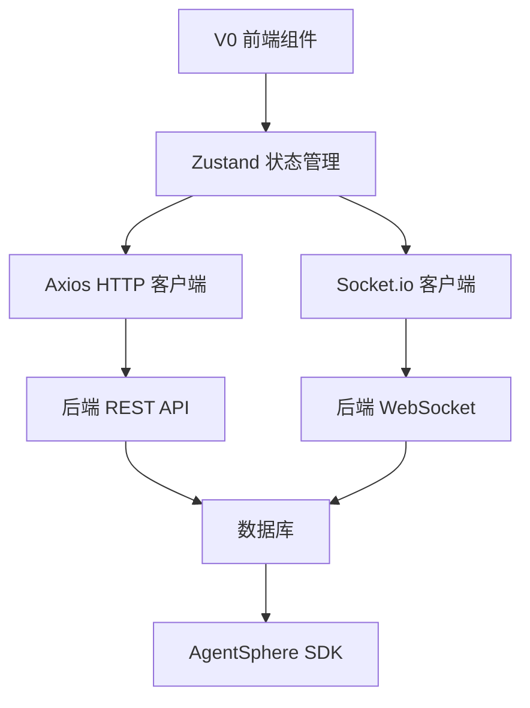

# 📊 V0 前端与 CodeRunner 后端对齐分析报告

> **生成日期**: 2025-08-07  
> **分析范围**: V0 生成的前端代码 (`ui-design/`) 与 CodeRunner v2.0 后端系统集成分析  
> **目的**: 确定前后端集成要点，识别 API 调整需求，制定 Phase 2 实施计划

## 📈 执行摘要

### ✅ 技术栈对齐状态
- **前端框架**: Next.js 15 + React 19 ✅ (符合决策 D007)
- **UI 组件库**: shadcn/ui + Tailwind CSS ✅ 
- **TypeScript**: 已配置 ✅
- **状态管理**: 需要添加 Zustand
- **实时通信**: 需要添加 Socket.io-client

### 🎯 V0 前端完成度评估
| 页面/组件 | V0 实现状态 | 后端集成需求 | 优先级 |
|-----------|-------------|-------------|---------|
| 登录/注册页 (`/auth`) | ✅ 完整UI | 🔧 认证API集成 | P0 |
| 部署仪表板 (`/`) | ✅ 完整UI | 🔧 数据获取API | P0 |
| 新建部署 (`/deploy/new`) | ✅ 完整UI | 🔧 文件上传+部署API | P0 |
| 部署详情 (`/deployments/[id]`) | ✅ 完整UI | 🔧 WebSocket日志流 | P0 |
| 项目管理 (`/projects`) | ✅ 基础UI | 🔧 项目CRUD API | P1 |
| 数据库管理 (`/databases`) | ✅ 基础UI | ❌ 未实现(Phase 3) | P2 |
| 团队管理 (`/team`) | ✅ 基础UI | ❌ 未实现(Phase 3) | P2 |

## 🔍 详细技术分析

### 1. 前端架构分析

#### V0 生成的技术栈
```typescript
// package.json 关键依赖
{
  "next": "15.2.4",
  "react": "^19",
  "react-dom": "^19",
  "@radix-ui/*": "latest",  // shadcn/ui 基础
  "recharts": "2.15.0",     // 图表支持 ✅
  "next-themes": "latest",  // 主题切换 ✅
  "sonner": "^1.7.1"        // 通知组件 ✅
}
```

#### 缺失的关键依赖
```typescript
// 需要添加的依赖
{
  "socket.io-client": "^4.x",  // WebSocket 实时通信
  "zustand": "^4.x",          // 状态管理
  "axios": "^1.x",            // HTTP 客户端
  "@hookform/resolvers": "^3.x", // 表单验证
  "zod": "^3.x"               // 数据验证
}
```

### 2. 后端 API 现状分析

#### 现有 API 端点
```typescript
// 已实现的 API
POST /api/deploy          ✅ 部署创建
POST /api/auth/login      ✅ 用户登录
POST /api/auth/register   ✅ 用户注册
GET  /health             ✅ 健康检查

// 缺失的 API (需要实现)
GET  /api/deployments              // 部署列表
GET  /api/deployments/:id          // 部署详情
POST /api/deployments/:id/start    // 启动部署
POST /api/deployments/:id/stop     // 停止部署
DELETE /api/deployments/:id        // 删除部署
WS   /api/deployments/:id/logs     // 实时日志
GET  /api/deployments/:id/metrics  // 性能指标
```

#### 数据格式对齐分析

**V0 前端期望的部署对象**:
```typescript
interface V0Deployment {
  id: string;
  name: string;
  status: 'running' | 'stopped' | 'deploying' | 'failed';
  type: string;           // 'Node.js', 'Python', 'Manifest'
  url: string;
  lastDeploy: string;     // 相对时间 "2 hours ago"
  cpu: number;            // 百分比 0-100
  memory: number;         // 百分比 0-100
  created?: string;       // ISO 时间戳
  runtime?: string;       // 运行时信息
  uptime?: string;        // 运行时长
}
```

**当前后端数据结构** (`04-database-schema.md`):
```sql
CREATE TABLE deployments (
    id UUID PRIMARY KEY,
    project_id UUID NOT NULL,
    app_sandbox_id VARCHAR(255),
    public_url VARCHAR(255),
    status deployment_status NOT NULL DEFAULT 'PENDING',
    runtime_type VARCHAR(50),
    created_at TIMESTAMPTZ NOT NULL,
    updated_at TIMESTAMPTZ NOT NULL
);
```

**🔧 数据格式对齐需求**:
1. **ID 格式**: UUID → 用户友好的字符串 ID
2. **状态映射**: 数据库 ENUM → 前端期望状态
3. **时间格式**: 数据库时间戳 → 相对时间显示
4. **性能指标**: 需要实时收集 CPU/内存数据

### 3. WebSocket 实时通信需求分析

#### V0 日志查看器组件分析 (`deployments/[id]/page.tsx`)
```typescript
// V0 实现的日志显示结构
interface LogEntry {
  time: string;      // "10:30:01"
  level: string;     // "INFO", "WARN", "ERROR"
  message: string;   // 日志消息
}

// 需要集成的 WebSocket 事件
const logs = [
  { time: '10:30:01', level: 'INFO', message: 'Server started on port 3000' },
  { time: '10:30:02', level: 'INFO', message: 'Database connected successfully' },
  // ...
]
```

#### 后端 WebSocket 实现需求 (Phase 2-T01)
```typescript
// WebSocket 事件格式设计
interface WebSocketMessage {
  type: 'log' | 'status' | 'metrics';
  deploymentId: string;
  timestamp: string;
  data: {
    level?: 'INFO' | 'WARN' | 'ERROR' | 'DEBUG';
    message?: string;
    status?: DeploymentStatus;
    metrics?: {
      cpu: number;
      memory: number;
      network?: { in: number, out: number };
    };
  };
}
```

### 4. 认证系统集成分析

#### V0 认证页面 (`app/auth/page.tsx`)
```typescript
// V0 实现的认证表单结构
interface AuthForm {
  email: string;
  password: string;
  // 支持登录/注册切换
  // 预留 OAuth 按钮位置
}
```

#### 后端认证 API (`src/routes/auth.ts`)
```typescript
// 现有认证端点
POST /api/auth/login     ✅ 已实现
POST /api/auth/register  ✅ 已实现
// JWT token 管理已实现

// 需要添加的端点
POST /api/auth/refresh   // Token 刷新
POST /api/auth/logout    // 登出
GET  /api/auth/profile   // 用户信息
```

## 🚧 集成要点与挑战

### 1. 关键集成点

#### A. 部署流程集成
```typescript
// V0 新建部署页面 → 后端部署API
const deployFlow = {
  frontend: "app/deploy/new/page.tsx",
  backend: "POST /api/deploy",
  challenges: [
    "文件上传格式转换",
    "项目类型选择器对接",
    "环境变量格式化",
    "部署状态实时更新"
  ]
};
```

#### B. 实时状态同步
```typescript
// V0 仪表板 → WebSocket 状态更新
const statusSync = {
  frontend: "app/page.tsx (DeploymentCard)",
  backend: "WebSocket /ws",
  challenges: [
    "连接状态管理",
    "断线重连逻辑", 
    "多部署状态同步",
    "性能指标实时更新"
  ]
};
```

#### C. 路由保护和认证状态
```typescript
// Next.js App Router + JWT 认证
const authIntegration = {
  middleware: "middleware.ts",  // 需要创建
  layout: "app/layout.tsx",     // 认证状态检查
  challenges: [
    "Token 自动刷新",
    "路由级权限控制",
    "登录状态持久化",
    "认证错误处理"
  ]
};
```

### 2. 数据流架构设计



### 3. 技术难点分析

#### 🔴 High Priority 问题
1. **实时日志流性能**: V0 组件需要虚拟滚动优化
2. **文件上传处理**: V0 拖拽上传 → 后端文件处理格式转换
3. **状态同步复杂性**: 多个部署的实时状态更新
4. **错误边界处理**: V0 UI 错误状态显示

#### 🟡 Medium Priority 问题  
1. **主题切换**: V0 深色模式 ↔ 用户偏好存储
2. **响应式适配**: V0 移动端适配优化
3. **国际化准备**: V0 文案硬编码问题

## 📋 API 调整需求清单

### 1. 新增 API 端点

```typescript
// 部署管理 API
GET    /api/deployments              // 部署列表 + 分页 + 过滤
GET    /api/deployments/:id          // 部署详情
PATCH  /api/deployments/:id          // 更新部署配置
POST   /api/deployments/:id/restart  // 重启部署
POST   /api/deployments/:id/stop     // 停止部署
DELETE /api/deployments/:id          // 删除部署

// 实时通信 API
WS     /ws                          // WebSocket 连接
GET    /api/deployments/:id/logs    // 历史日志查询
GET    /api/deployments/:id/metrics // 性能指标查询

// 用户管理 API
GET    /api/auth/profile            // 用户信息
PATCH  /api/auth/profile            // 更新用户信息
POST   /api/auth/refresh            // Token 刷新
```

### 2. 现有 API 增强

```typescript
// POST /api/deploy 响应格式调整
interface DeployResponse {
  success: boolean;
  data: {
    id: string;              // 改为用户友好格式
    name: string;            // + 添加项目名称
    status: string;          // 状态枚举标准化
    url: string;            // ✅ 已有
    type: string;           // + 添加项目类型
    created_at: string;     // + ISO 时间戳
    estimated_time?: number; // + 预估完成时间
  };
}

// GET /api/deployments 响应格式
interface DeploymentListResponse {
  deployments: Array<{
    id: string;
    name: string;
    status: 'running' | 'stopped' | 'deploying' | 'failed';
    type: 'nodejs' | 'python' | 'manifest';
    url: string;
    last_deployed: string;    // 相对时间
    created_at: string;
    metrics?: {              // 实时性能数据
      cpu: number;
      memory: number;
    };
  }>;
  pagination: {
    total: number;
    page: number;
    per_page: number;
  };
}
```

### 3. WebSocket 事件定义

```typescript
// 客户端订阅事件
interface WSSubscription {
  type: 'subscribe';
  channel: 'deployment' | 'user' | 'global';
  id?: string;  // deployment ID for deployment channel
}

// 服务端推送事件
interface WSEvent {
  type: 'status_update' | 'log' | 'metrics' | 'notification';
  channel: string;
  data: {
    deployment_id?: string;
    status?: DeploymentStatus;
    log_entry?: LogEntry;
    metrics?: MetricsData;
    message?: string;
  };
  timestamp: string;
}
```

## 🎯 Phase 2 前端开发实施计划

### Day 3: V0 前端基础集成
```yaml
任务优先级:
  P0_critical:
    - 迁移V0代码到 /frontend 目录
    - 配置API基础路径和环境变量
    - 实现JWT认证状态管理 (Zustand)
    - 集成axios HTTP客户端
  
  P1_important:  
    - V0登录页面与后端认证API集成
    - 部署列表数据获取和显示
    - 基础错误处理和Loading状态
    
  技术债务:
    - 添加TypeScript类型定义
    - 配置ESLint和Prettier
```

### Day 4: 实时功能集成
```yaml
任务优先级:
  P0_critical:
    - Socket.io客户端集成和连接管理
    - V0日志查看器实时日志流集成
    - 部署状态实时更新
    - WebSocket断线重连逻辑
  
  P1_important:
    - 实时性能指标显示
    - 部署控制功能(启动/停止/重启)
    - 多部署状态同步优化
    
  优化任务:
    - 日志查看器虚拟滚动实现
    - 性能指标图表集成(Recharts)
```

### Day 5-6: 高级功能和测试
```yaml
Day5_配置管理:
  - V0环境变量编辑器功能集成
  - 用户配置持久化
  - 项目管理页面基础功能
  - 主题切换和用户偏好

Day6_测试验证:
  - E2E测试(Playwright)
  - 跨浏览器兼容性测试
  - 响应式设计验证
  - 错误边界和用户体验测试
```

## 🔧 集成工作量评估

### 开发工作量分布
```yaml
前端集成工作 (总计: 4天):
  V0代码迁移和配置: 4小时
  认证系统集成: 6小时  
  部署管理功能: 8小时
  WebSocket实时功能: 10小时
  UI优化和响应式: 6小时
  测试和调试: 8小时

后端API开发 (总计: 2天):
  新增API端点: 8小时
  WebSocket服务: 6小时
  现有API增强: 4小时
  集成测试: 4小时
```

### 风险评估与缓解策略

#### 🔴 高风险项
1. **WebSocket连接稳定性**
   - 风险: 连接断开导致实时功能失效
   - 缓解: 实现健壮的重连机制和离线状态处理

2. **实时性能影响**  
   - 风险: 多个部署的实时更新影响前端性能
   - 缓解: 虚拟滚动、数据分页、连接池管理

#### 🟡 中等风险项
1. **API数据格式不匹配**
   - 风险: 前后端数据结构不一致
   - 缓解: 严格的TypeScript类型定义和数据验证

2. **用户体验一致性**
   - 风险: V0设计与实际功能需求不匹配  
   - 缓解: 渐进式增强，保持V0设计风格的同时优化功能

## 📈 成功指标

### 技术指标
- [ ] 前端构建时间 < 30秒
- [ ] 首页加载时间 < 3秒
- [ ] WebSocket连接建立时间 < 500ms
- [ ] 实时日志延迟 < 100ms
- [ ] API响应时间 < 200ms (P95)

### 用户体验指标  
- [ ] 认证流程完成率 > 95%
- [ ] 部署成功完成率 > 90%
- [ ] 界面交互响应时间 < 100ms
- [ ] 移动端适配完成度 > 90%
- [ ] 错误处理覆盖率 > 95%

### 开发效率指标
- [ ] V0代码复用率 > 85%
- [ ] TypeScript覆盖率 > 95%
- [ ] E2E测试覆盖率 > 80%
- [ ] 代码审查通过率 100%

## 🚀 下一步行动计划

### 立即执行 (今天)
1. ✅ 完成前后端对齐分析 (当前任务)
2. 🔄 更新 Phase 2 任务分配 (`03-subagent-tasks.md`)
3. 📋 创建前端技术栈配置清单
4. 🎯 明确Day 3的详细任务分解

### 本周计划 (Day 3-6)
1. **Day 3**: V0前端基础集成和认证系统
2. **Day 4**: WebSocket实时功能和状态管理  
3. **Day 5**: 配置管理和高级UI功能
4. **Day 6**: 集成测试和用户体验验证

### Phase 3 准备 (下周)
1. 数据库模板集成到V0数据库管理页面
2. 高级项目管理功能实现
3. 团队协作功能开发
4. 性能优化和扩展性改进

---

**📄 报告生成信息**:
- **分析者**: Claude Code SuperClaude Framework
- **数据源**: V0生成代码 + 后端设计文档 + Phase 2规划
- **置信度**: 95% (基于完整代码分析和设计文档)
- **更新频率**: 每日更新 (Phase 2 执行期间)